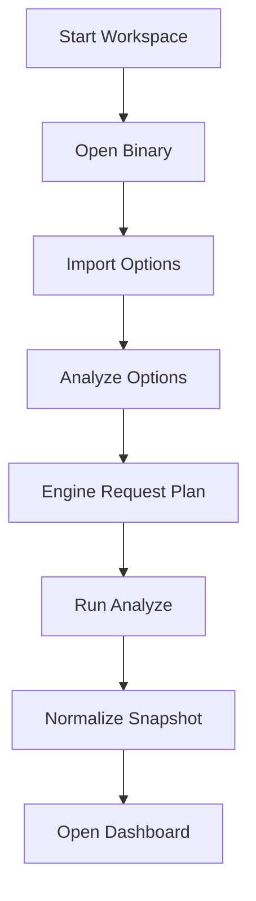
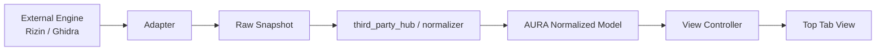

# D-UI: Top Tab Workbench (AURA Qt UI Redesign)

> **Status**: 설계 문서 신규 (2026-04-30). 구현 금지.  
> **Scope**: AURA 전용 상단 탭 기반 워크벤치 UI. Cutter / IDA / Ghidra 는 참고 대상이며, 기존 Qt 레이아웃은 재사용 기준이 아니다.
>
> **Hard rules**:
> - AURA UI 는 엔진 UI 가 아니다. UI 는 `View Layer` 이고, Rizin / Ghidra / RetDec 결과를 교체 가능한 normalized model 로 소비한다.
> - 하단 탭 / 사이드 탭 / docking / 창 분리 / multi-panel split 은 본 설계 범위 밖이다.
> - 기존 `main_window.cpp` 레이아웃, `sidebar`, `panels` 구조를 점진 개선하지 않는다. 새 워크벤치 구조를 만든다.

---

## 1. 제품 형태

AURA 의 GUI 는 reverse engineering 작업을 위한 **상단 탭 워크벤치**이다.

참고 기준:

| 도구 | 참고할 부분 | AURA 에서 바꿀 부분 |
|------|-------------|--------------------|
| Cutter | 시작 화면, 파일 열기, 함수 목록 가독성, 대시보드 중심 탐색 | 하단 탭 대신 상단 탭으로 재구성 |
| IDA Pro | 상단 메뉴 밀도, 명령 중심 워크플로우, 함수 단위 이동 | 낡은 고정 패널 구조는 따르지 않음 |
| Ghidra | Import 후 Analyze 옵션을 단계적으로 선택하는 흐름 | Project-heavy UX 는 AURA 에 맞게 단순화 |

첫 화면은 마케팅/랜딩이 아니라 작업 화면이다. 파일을 열기 전에는 `Start Workspace` 상태를 보여주고, 파일 선택 후 `Import Options`, `Analyze Options`, `Workspace` 로 이동한다.

---

## 2. 전체 레이아웃

```
┌─────────────────────────────────────────────────────────────┐
│ Menu Bar: File Edit View Analyze Navigate Tools Help         │
├─────────────────────────────────────────────────────────────┤
│ Command Bar: Open | Analyze | Engine | Search | Address      │
├─────────────────────────────────────────────────────────────┤
│ Top Tab Strip                                                │
│ [Dashboard] [Disasm: main] [Decompile: main] [CFG: main] ... │
├─────────────────────────────────────────────────────────────┤
│ Active View Surface                                          │
│                                                             │
│  Dashboard / Disasm / Decompile / CFG / Callgraph / Hex      │
│  / Strings / Symbols / Imports / Exports / Types             │
│                                                             │
├─────────────────────────────────────────────────────────────┤
│ Status Bar: binary | engine source | analysis state | cursor │
└─────────────────────────────────────────────────────────────┘
```

### 2.1 Menu Bar

IDA 식 상단 메뉴 밀도를 따른다.

| 메뉴 | 주요 항목 |
|------|----------|
| File | Open Binary, Open Project, Save Project, Close Binary |
| Edit | Rename, Comment, Copy Address, Copy Bytes |
| View | Dashboard, Functions, Strings, Symbols, Hex, Types |
| Analyze | Import Options, Analyze Current Binary, Re-run Analyze |
| Navigate | Go to Address, Back, Forward, Function Start |
| Tools | Settings, Engine Selection, Export |
| Help | About, Diagnostics |

### 2.2 Command Bar

상단 메뉴 아래에 고정된다. 반복 작업을 빠르게 하기 위한 얇은 도구줄이다.

- `Open`: binary/project 선택
- `Analyze`: 현재 import 설정으로 analyze 실행
- `Engine`: request type 별 primary/co-primary 상태 표시
- `Search`: symbols / strings / addresses 통합 검색
- `Address`: 주소 직접 이동

### 2.3 Top Tab Strip

모든 주요 view 는 상단 탭으로만 열린다. 하단 탭과 사이드 탭은 금지한다.

---

## 3. 탭 모델

### 3.1 Tab Identity

탭 식별자는 다음 튜플이다.

```
TabId = {
    view_type,
    function_addr,
    binary_id
}
```

`function_addr` 가 없는 전역 view 는 `function_addr = null` 을 사용한다.

예:

| 탭 | TabId |
|----|-------|
| Dashboard | `(dashboard, null, binary_id)` |
| Strings | `(strings, null, binary_id)` |
| Disasm main | `(disasm, 0x401000, binary_id)` |
| Decompile main | `(decompile, 0x401000, binary_id)` |
| CFG main | `(cfg, 0x401000, binary_id)` |
| Callgraph main | `(callgraph, 0x401000, binary_id)` |
| Hex at VA | `(hex, null, binary_id)` with cursor state |

### 3.2 Duplicate Policy

기본 정책은 **reuse** 이다.

- 같은 `TabId` 가 이미 열려 있으면 새 탭을 만들지 않고 기존 탭으로 focus 이동.
- 사용자가 명시적으로 `Open Duplicate` 를 선택한 경우에만 suffix 를 붙인다: `Disasm: main #2`.
- Duplicate tab 도 engine 에 직접 묶이지 않는다. 같은 normalized snapshot 을 다른 cursor/state 로 보여주는 별도 view instance 일 뿐이다.

### 3.3 Lazy Loading

탭 생성 시 즉시 heavy content 를 만들지 않는다.

1. 탭 shell 생성: title, icon, `TabId`, pending state 저장.
2. 탭이 활성화되면 `ViewController.load(TabId)` 호출.
3. 필요한 normalized records 를 model 에서 조회.
4. view state 를 적용하고 render.

실패 시 탭은 닫지 않고 error state 를 표시한다. 재시도는 사용자가 명시적으로 실행한다.

### 3.4 Tab Reorder

상단 탭은 좌클릭 drag-and-drop 으로 순서를 변경한다.

요구사항:

- drag 시작: 일정 거리 이상 이동 시 reorder mode 진입
- 이동 중: 삽입 위치 indicator 표시
- drop: tab order 만 갱신, content reload 금지
- cancel: 기존 순서 유지

상태 유지:

- scroll position
- cursor address
- text selection
- active function
- decompile line mapping
- graph zoom / pan

### 3.5 Tab Commands

탭 우클릭 메뉴:

| 명령 | 동작 |
|------|------|
| Close | 현재 탭 닫기 |
| Close Others | 현재 탭 외 닫기 |
| Close Tabs to the Right | 오른쪽 탭 닫기 |
| Close All | Dashboard 를 제외하고 모두 닫기 |
| Reload View | 현재 탭만 lazy reload |
| Copy Address | 함수 탭이면 `function_addr` 복사 |

### 3.6 Session Restore

세션에는 탭 목록과 상태만 저장한다. 엔진 raw response 를 UI session 이 소유하지 않는다.

저장 항목:

```
WorkbenchSession {
    binary_path
    project_id
    active_tab_id
    tab_order[]
    tab_states[]
}

TabState {
    tab_id
    title
    scroll
    cursor_addr
    selection
    graph_zoom
    graph_pan
    loaded
}
```

복원 순서:

1. project/binary 를 연다.
2. normalized snapshot 존재 여부를 확인한다.
3. tab shell 을 복원한다.
4. active tab 만 lazy load 한다.
5. 나머지는 선택될 때 load 한다.

---

## 4. View Types

### 4.1 Global Views

| View | 목적 | 주요 입력 |
|------|------|-----------|
| Dashboard | binary 요약, entry, section, 분석 상태 | ProjectModel, AnalysisSummary |
| Functions | 함수 목록, 주소, 크기, provenance | FunctionRecord[] |
| Strings | 문자열 목록, 주소, section | String/Xref records |
| Symbols | symbol/import/export 목록 | SymbolRecord[] |
| Hex | byte view, VA/RVA 이동 | mapped binary bytes |
| Types | 타입 사실 목록 | TypeFactRecord[] |

### 4.2 Function Views

| View | 목적 | 주요 입력 |
|------|------|-----------|
| Disasm | 함수 단위 instruction view | normalized disasm records |
| Decompile | 함수 단위 pseudo-C | decompile response + line map |
| CFG | 함수 단위 basic block graph | BlockRecord[] + EdgeRecord[] |
| Callgraph | caller/callee graph | CallEdgeRecord[] |

함수 view 는 항상 `function_addr` 를 가진다. 주소가 없으면 열 수 없다.

---

## 5. Import -> Analyze UX

Ghidra 의 단계적 import/analyze 흐름을 AURA 에 맞게 단순화한다.

### 5.1 Flow



### 5.2 Import Options

파일을 선택하면 즉시 분석하지 않는다. 먼저 import preview 를 보여준다.

필드:

- file path
- format guess
- architecture guess
- entry point
- image base
- sections preview
- project location

사용자 선택:

- project 생성/기존 project 에 추가
- architecture override
- base address override
- read-only import

### 5.3 Analyze Options

분석 옵션은 request type 별로 나눈다.

| Request Type | 기본 엔진 | UI 표시 |
|--------------|-----------|---------|
| disasm | Rizin planned / third_party hub planned | disabled until implemented |
| analyze | Rizin | enabled |
| decompile | Rizin / Ghidra co-primary | selectable |
| trace | Rizin planned | disabled until implemented |

Phase 2A 에서는 `analyze=Rizin` 만 실제 실행 가능하다. 비활성 request 는 보이되 실행 버튼은 비활성화한다.

### 5.4 Engine Request Plan

Analyze 실행 전, AURA 는 엔진 명령이 아니라 **request plan** 을 보여준다.

예:

```
Analyze Plan
- analyze: rizin
- decompile: not selected
- raw response: preserve
- normalized records: Function / Block / Edge / Symbol
```

UI 는 Rizin 명령어(`aaa`, `aflj`)를 노출하지 않는다. 해당 내용은 adapter diagnostics 에서만 볼 수 있다.

---

## 6. Engine Independence

UI 의 데이터 흐름은 다음 경계를 지킨다.



금지:

- 탭이 `RzCore`, `RzAnalysisFunction`, Ghidra XML node 를 직접 참조
- 탭 title / state 에 engine command 저장
- view 가 engine subprocess 를 직접 호출
- UI 가 CFG / call graph / type 을 자체 추론

허용:

- status bar 에 `source=rizin`, `confidence`, `completeness` 표시
- diagnostics panel 에 raw response 존재 여부 표시
- 같은 `TabId` 에 대해 엔진 결과가 바뀌면 normalized snapshot version 을 교체하고 view 를 reload

---

## 7. Existing Module Mapping

### 7.1 Reuse

| 기존 모듈 | 새 역할 |
|-----------|---------|
| `file_loader` | Open Binary / Import Options 의 파일 판별과 preview backend |
| `project` | project metadata, recent file, binary/session persistence |
| `project_manager_window` | Start Workspace / Open Project flow 의 참고 구현 |
| `analysis_dispatcher` | Analyze Options 에서 만든 request plan 실행 coordinator |
| `analysis_worker` | background analyze task runner |
| `cfg_view` | `CFGView` function tab renderer 로 이식 |
| `callgraph_view` | `CallgraphView` function tab renderer 로 이식 |
| `pseudoc_highlighter` | Decompile tab syntax highlighting |
| `theme_manager` | 새 workbench theme base |
| `nav_history` | Navigate Back/Forward state |
| `decompile_menu_target` | Decompile tab context action address mapping |

### 7.2 Replace

| 기존 모듈 | 처리 |
|-----------|------|
| `main_window.cpp` layout | 폐기. 새 `WorkbenchWindow` 로 대체 |
| `sidebar` | 폐기. top tab only 원칙 위반 |
| `panels` | 폐기. old panel composition 제거 |
| 하단/측면 중심 navigation | 폐기. top tab strip 으로 통일 |

---

## 8. New UI Components

구현 시 새 파일명은 기존 구조와 분리한다.

```
src/gui/workbench/
├── workbench_window.{h,cpp}
├── workbench_menu.{h,cpp}
├── command_bar.{h,cpp}
├── top_tab_bar.{h,cpp}
├── tab_model.{h,cpp}
├── tab_state.{h,cpp}
├── view_controller.{h,cpp}
├── import_wizard.{h,cpp}
├── analyze_wizard.{h,cpp}
├── views/
│   ├── dashboard_view.{h,cpp}
│   ├── functions_view.{h,cpp}
│   ├── strings_view.{h,cpp}
│   ├── symbols_view.{h,cpp}
│   ├── hex_view.{h,cpp}
│   ├── disasm_view.{h,cpp}
│   ├── decompile_view.{h,cpp}
│   ├── cfg_function_view.{h,cpp}
│   └── callgraph_function_view.{h,cpp}
└── session/
    └── workbench_session.{h,cpp}
```

기존 `src/gui/main_window.*` 는 새 코드가 안정화될 때까지 삭제하지 않는다. 단, 새 workbench 구현은 include 하지 않는다.

---

## 9. Phase / PR Plan

### PR-UI-1: Design Binding

- 본 문서 추가
- 기존 Qt 파일 변경 없음
- `AURA_BUILD_GUI` default OFF 유지

Exit:

- 문서가 top tab only, engine-independent, reuse/replace boundary 를 명시한다.

### PR-UI-2: Workbench Skeleton

- `src/gui/workbench/` 생성
- `WorkbenchWindow`, `CommandBar`, `TopTabBar`, `TabModel` skeleton
- legacy `main_window.cpp` 와 독립 빌드
- `AURA_BUILD_NEW_GUI` option 추가

Exit:

- 빈 Dashboard 탭이 상단 탭으로 열린다.
- tab reorder shell 동작.

### PR-UI-3: Import / Analyze Wizard

- `ImportWizard`, `AnalyzeWizard`
- `file_loader`, `project`, `analysis_dispatcher`, `analysis_worker` 연결
- request plan preview

Exit:

- 파일 선택 후 바로 분석하지 않고 options 단계를 거친다.

### PR-UI-4: Global Views

- Dashboard / Functions / Strings / Symbols / Hex
- Functions 에서 함수 더블클릭 시 `Disasm(function_addr)` 탭 open/reuse

Exit:

- tab identity/reuse/lazy loading 검증.

### PR-UI-5: Function Views

- Disasm / Decompile / CFG / Callgraph
- `cfg_view`, `callgraph_view`, `pseudoc_highlighter`, `decompile_menu_target`, `nav_history` 이식

Exit:

- 같은 함수에 대해 4개 function tab 을 열고 상태 유지.

### PR-UI-6: Session Restore

- `WorkbenchSession` 저장/복원
- tab order, active tab, cursor/scroll/graph state 복원

Exit:

- app 재시작 후 active tab 과 state 가 복원된다.

### PR-UI-7: Legacy GUI Retirement Gate

- 새 GUI가 최소 기능을 통과하면 legacy `main_window/sidebar/panels` 제거 후보 분리
- 삭제는 별도 승인 후 진행

Exit:

- legacy GUI 는 빌드 option 으로만 남거나 제거 계획 확정.

---

## 10. Non-goals

본 설계 단계에서 하지 않는다.

- 탭 분할 / docking / floating window
- collaboration panel
- AI recommendation UI
- history timeline UI
- 기존 `main_window.cpp` 점진 개선
- engine command 노출형 UI
- Rizin / Ghidra specific tab implementation

---

## 11. Failure Gates

다음이 발견되면 구현을 중단하고 설계를 다시 확인한다.

| 실패 조건 | 중단 이유 |
|-----------|-----------|
| 새 workbench 가 `main_window.cpp` layout 을 include/상속 | 기존 Qt 구조 재활용 중심 설계 |
| 탭이 engine raw/canonical type 을 직접 참조 | 엔진 독립성 위반 |
| 하단/측면 탭 또는 docking 추가 | Top Tab Only 위반 |
| import 직후 자동 analyze 강제 | Ghidra-style 단계적 UX 위반 |
| `FunctionRecord` 부속 필드 기반 UI 설계 | normalized record 1 급화 위반 |
| 구현 PR 이 본 문서 없이 UI 구조를 바꿈 | 설계 binding 위반 |

