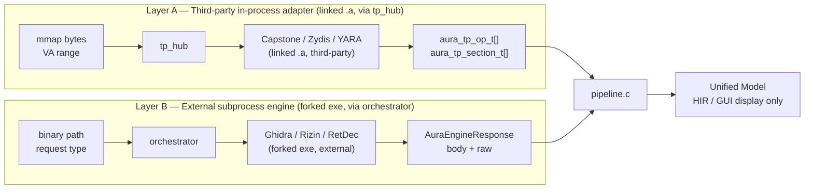
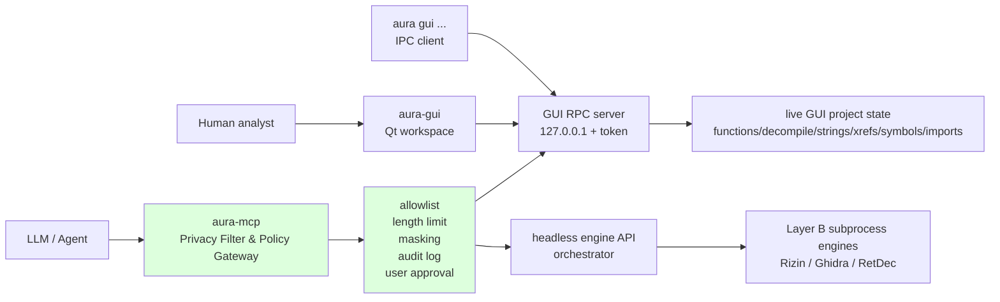
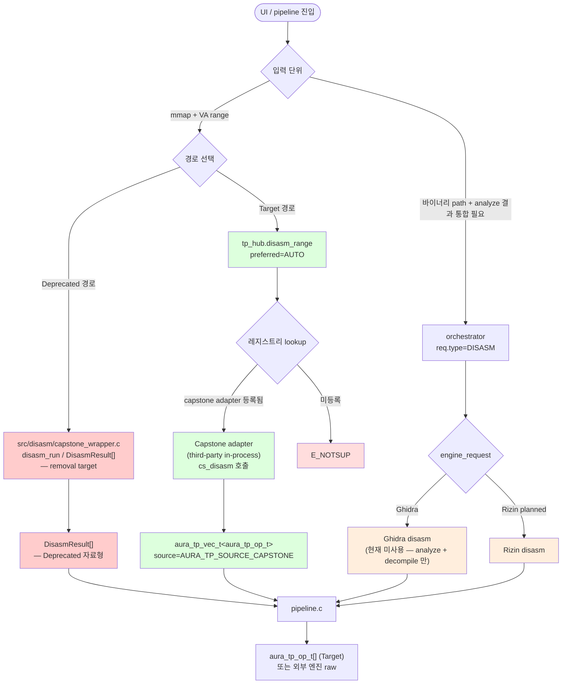
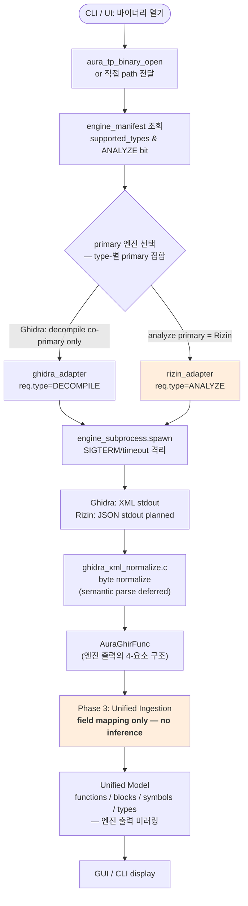
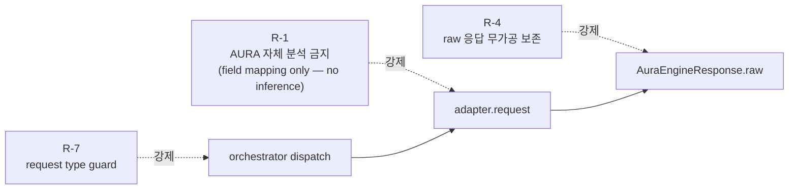
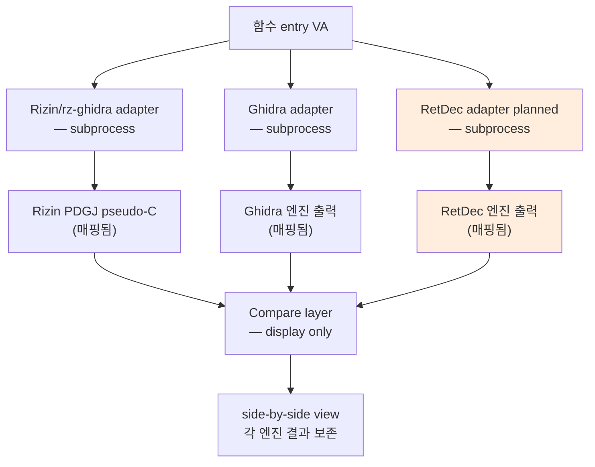
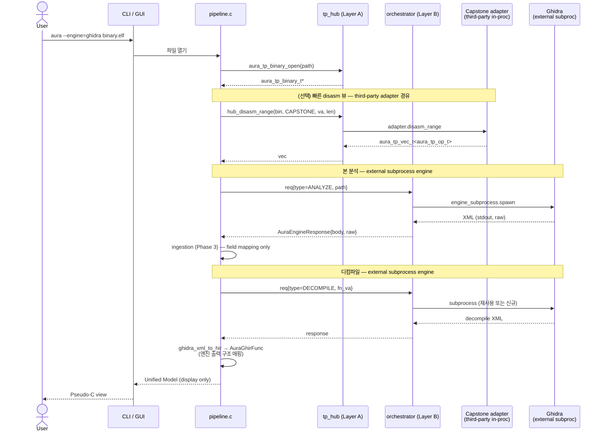

# Pipeline Flows — Disassembly / Analysis / Decompilation

> 작성일: 2026-04-30 (deprecated 표기 개정).  본 문서는 AURA 가 외부 엔진 결과를 ingest / transform / display 하는 **3 가지 핵심 파이프라인** 의 흐름을 다이어그램으로 정리한다.
>
> 핵심 원칙 (Tasks.md, rules R-1):
> - AURA 본체는 disassembly / analysis / decompilation 을 **직접 수행하지 않는다**. 모든 결과는 외부 엔진(subprocess) 또는 third-party 라이브러리(in-process) 의 출력이다.
> - AURA 의 역할은 **ingest → normalize → display** 만 한다 — raw engine response 보존(R-4) + schema/HIR/Unified Model 매핑만. CFG·IR·타입·pseudo-code 자체 추론·생성 금지(R-1).
> - **Legacy AURA disassembler / decompiler 경로는 deprecated 이며 removal target 이다.** 본 문서의 모든 "AURA 자체 disasm/decompile" / 레거시 wrapper 표현은 historical 맥락에서만 사용되며, 새 코드는 third-party adapter 경로(Layer A) 또는 subprocess engine 경로(Layer B) 만 사용한다.
> - Capstone / Zydis = "AURA 자체 disasm" 이 아니라 `third_party/{capstone,zydis}/` 의 외부 라이브러리이며, AURA 는 third_party_hub 어댑터를 통해 호출만 한다.
> - Ghidra / Rizin / RetDec = subprocess adapter 를 통해 호출되는 외부 엔진.

### 다이어그램 라벨링 표준 (본 문서 전체 적용)

mermaid 노드 색상 / 라벨 컨벤션:

| 라벨 | 색상 (style fill) | 의미 |
|------|------------------|------|
| Current | (default) | 현재 동작 — 머지된 코드 |
| **Deprecated** | `#fcc` (옅은 빨강) | 제거 예정 legacy 경로 |
| Planned | `#fed` (옅은 노랑) | 미구현 계획 |
| Target | `#dfd` (옅은 초록) | 도달 목표 아키텍처 |
| Error | `#fdd` (밝은 빨강) | 에러 경로 |

---

## 0. 두 개의 분리된 레이어

AURA 는 외부 코드를 두 가지 방식으로 사용하며, 각각 다른 입출력 표면을 갖는다.

- **Layer A — Third-party in-process adapter layer** (linked `.a`, called via `tp_hub`). Capstone / Zydis / YARA 같이 라이선스 호환 (BSD/MIT 등) 라이브러리를 정적 링크하고, `aura_tp_adapter_t` 어댑터를 거쳐 호출한다. AURA 와 동일 프로세스에서 실행되므로 격리는 없다.
- **Layer B — External subprocess engine layer** (forked `.exe`, called via `orchestrator`). Ghidra / Rizin / RetDec 같이 무거운 분석 엔진을 별도 프로세스로 fork 하고, `engine_subprocess` 위에 `AuraEngineRequest` / `AuraEngineResponse` 로 통신한다. crash/timeout 격리(R-7) 가 본 레이어의 핵심 가치.



| 축 | Layer A (tp_hub — third-party in-process adapter) | Layer B (orchestrator — external subprocess engine) |
|----|----------------------------------------------------|------------------------------------------------------|
| 위치 | in-process (linked `.a`) | subprocess (forked `.exe`, 격리) |
| 헤더 | `include/third_party_hub/` | `include/engine_request.h` |
| 입력 단위 | mmap'd 바이트 + VA | 바이너리 경로 + request type |
| 후보 | Capstone, Zydis, YARA (third-party libs) | Ghidra, Rizin, RetDec (external engines) |
| 격리 | × (프로세스 공유) | ○ (subprocess crash 격리, R-7) |
| 적합한 작업 | 빠른 disasm view, 패턴 스캔 | analyze, decompile, 무거운 분석 |
| 현재 상태 | skeleton 머지 (어댑터 0개 — 마이그레이션 대기) | Phase 1 어댑터 계약 완료, **Phase 2 Rizin primary 진행** (analyze 2A / decompile 2B), Ghidra = decompile co-primary (2C 이관) |

---

## 0.1 Frontend / IPC / MCP control flow

실행 표면은 엔진 레이어와 분리한다. GUI 는 사람이 보는 long-lived Qt
process 이고, CLI 의 `gui` subcommand 는 나중에 실행되어 현재 GUI 에
붙는 localhost IPC client 다. LLM/agent 는 GUI RPC 나 Rizin 에 직접 붙지
않고, 계획된 `aura-mcp` Privacy Filter & Policy Gateway 를 통해 정책
적용 후 접근한다. 기본 구조는 2개 생성형 LLM 상시 배치가 아니라 1개
생성형 LLM + PII 특화 모델·데이터셋 기반 Privacy Filter + policy
gateway 다.



현재 구현:

- `aura-gui --rpc-port <port>` 또는 `$AURA_GUI_RPC_PORT` 로 GUI RPC 서버
  opt-in.
- RPC 는 `127.0.0.1` bind + token 필수 + v1 single-client 정책.
- `aura gui status/open-project/add-binary/analyze/functions/decompile/...`
  가 실행 중인 GUI 에 접속한다.

GUI 표시 계약:

- 기본 workspace 는 Cutter식 좌측 브라우저 + 우측 코드 탭이다.
- 좌측 상단: Functions/Xrefs. 좌측 하단: Strings/Symbols/Imports.
- 우측: Decompile/Disassembly/Full Disassembly/CFG/Hex.
- 좌측 브라우저는 모두 `QTreeView` 이며, parent row 는 엔티티 대표값,
  child row 는 엔진 record 의 metadata 필드다.
- GUI 는 display layer 이므로 누락 metadata 를 추론하지 않는다. 엔진이
  값을 주지 않으면 `-` 로 표시한다.
- 함수 단위 Disassembly 는 `pdfj/pdf @ function_entry` 로 flow arrows 와
  함수 내부 instruction stream 을 표시한다.
- Full Disassembly 는 Cutter-style 연속 VA listing 이며, 함수 목록 선택 시
  해당 주소로 스크롤/하이라이트한다. 내부 엔진 호출은 `pdj <count>`
  structured stream 과 bounded `pD 4096` arrow text 를 함께 사용한다.
  `Structured` 탭은 `pD` mixed listing 을 분류해 invalid/data/comment/label
  줄도 보존하고, `With arrows` 탭은 Rizin 원문을 표시한다. Rizin 0.8.0
  timeout 방지를 위해 arrow text 는 4KB hard cap 으로 둔다. Chunk cache /
  lazy paging 은 아직 미구현이며 Cutter급 스크롤 효율은 후속 phase 다.

계획:

- `aura-mcp` 는 별도 실행 파일로 둔다.
- `aura-mcp` 는 생성형 LLM 모델이 아니라 privacy/policy gateway 다.
  기본 제품 구조는 1개 생성형 LLM + gateway 이며, 내부 verifier 같은
  두 번째 생성형 모델은 별도 승인 전까지 범위 밖이다.
- Privacy filter 는 현재 문자열 기반 MVP 에서 시작한다. 목표 구조는
  **PII 특화 모델과 데이터셋 기반 탐지를 결합한 민감정보 마스킹 시스템**이며,
  binary path, token, API key, secret, 민감 문자열, 원본 decompile 대량
  본문을 마스킹/축약한다.
- MCP tool 은 read-only / bounded output 을 기본값으로 하며, 원본
  decompile 전체 반환은 정책 허가 없이는 금지한다.
- MCP 는 GUI IPC 를 재사용할 수 있지만, GUI IPC 자체는 LLM 공개 API 가
  아니다.

---

## 1. 디스어셈블리 (Disassembly)

목적: VA 범위 → 명령어 스트림.

> Capstone / Zydis 는 AURA 의 자체 disassembler 가 **아니다** — `third_party/capstone/` · `third_party/zydis/` 의 외부 라이브러리이며, AURA 는 `third_party_hub` 어댑터를 통해 호출만 한다. 과거의 자체 wrapper 경로(`disasm_run`, `DisasmResult[]`)는 deprecated / removal target 이다.

### 1.1 흐름 (Current / Deprecated / Target)



범례: 빨강(`#fcc`)=Deprecated, 초록(`#dfd`)=Target, 노랑(`#fed`)=Planned, 밝은빨강(`#fdd`)=Error.

### 1.2 Legacy Capstone wrapper 경로 — Deprecated / removal target

> ⚠️ **Deprecated**: 본 경로는 historical 참조용이다. `src/disasm/capstone_wrapper.c` 는 AURA 자체 disassembler 가 아닌 third-party Capstone (`third_party/capstone/`) 호출의 legacy wrapper 이며, third_party_hub 의 Capstone 어댑터로 대체될 예정이다.

```text
mmap bytes (uint8_t*)                     ← src/parser/mapped_file.c
        │
        ▼  [Deprecated — legacy wrapper, not AURA-native disasm]
disasm_run(ctx, bytes, size, base, ...)   ← src/disasm/capstone_wrapper.c
        │
        ▼ Capstone (third-party) 내부
cs_disasm() → cs_insn[]
        │
        ▼  [Deprecated 자료형 — removal target]
DisasmResult[]
        │
        ▼
pipeline.c (현재 호출부 — 마이그레이션 대상)
```

### 1.3 Third-party Capstone adapter 경로 — Target architecture

본 경로가 도달 목표다. legacy wrapper 가 제거되면 모든 Capstone 호출이 본 경로를 통과한다.

```text
aura_tp_binary_t* (mmap)                  ← Layer A 단일 입력 핸들
        │
        ▼
aura_tp_hub_disasm_range(bin, AUTO, va, len, &out_ops)
        │
        ▼ tp_hub.c → resolve(AUTO, CAP_DISASM_RANGE)
        ▼
adapter_capstone.disasm_range(ctx, va, len, out_ops)
        │   (third-party in-process adapter — AURA 자체 disasm 아님)
        ▼ Capstone 내부 cs_disasm()
        ▼
aura_tp_vec_t<aura_tp_op_t>              ← source = AURA_TP_SOURCE_CAPSTONE
        │
        ▼
pipeline.c (단일 입력 표면 — Layer A/B 공용)
```

---

## 2. 분석 (Analysis)

목적: 함수·심볼·CFG·타입 추출.

> **AURA 는 함수·심볼·CFG·타입을 자체 생성하지 않는다.** Rizin (analyze primary) / Ghidra (decompile co-primary) 등 외부 엔진 (Layer B subprocess) 의 출력 필드를 1:1 매핑할 뿐이며 (Phase 3), 누락된 데이터를 추론·보강하지 않는다 (R-1). 자체 정적 분석 패스는 본 파이프라인에 존재하지 않는다. Rizin 은 librz 링크 없이 별도 프로세스 stdout JSON 으로만 통신한다 (D-27, R-10).

### 2.1 흐름



### 2.2 자료형 변환 체인 (Ghidra subprocess 경로 — Phase 2 진행중)

```text
binary path  ─┐
function VA ─ │  ← AuraEngineRequest { type=ANALYZE, payload }
config      ─┘
        │
        ▼ src/adapter/ghidra/ghidra_adapter.c
adapter.request(req, &resp)
        │
        ▼ engine_subprocess.spawn (R-7 isolation, Layer B)
        ▼
[Ghidra 외부 프로세스 — subprocess engine] → XML stdout
        │                          │
        ▼ engine_subprocess.drain  │ stderr → diagnostic
        ▼                          │
AuraEngineResponse {               │
    .body = normalized,            │
    .raw  = XML 원본 (R-4 보존)    │  ← AURA 측 임의 변형·정정·보강 금지
}
        │
        ▼ src/adapter/ghidra/ghidra_xml_normalize.c (byte normalize)
        ▼   (엔진 출력의 구조 매핑 — 새 IR 생성 아님)
        ▼
AuraGhirFunc { func / block / edge / variable }
        │
        ▼ Phase 3: ingestion (Tasks.md 3.1~3.4)
        ▼   field mapping only — no CFG/IR/type inference (R-1)
        ▼
Unified Model (canonical fields — 엔진 출력 미러링)
```

### 2.3 R-1 / R-4 / R-7 강제 지점



- **R-1**: ingestion 단계 어디에서도 새로운 CFG / IR / 타입 / 데이터 흐름을 **생성하지 않는다**. 누락된 필드는 누락된 채 유지하거나 diagnostic 으로만 표시한다 (Tasks.md Phase 3.4).
- **R-4**: `AuraEngineResponse.raw` 는 엔진 stdout 원본을 그대로 detach. 정정·필터링·필드 합성 금지.
- **R-7**: `orchestrator` 가 request.type 비트를 manifest.supported_types 와 AND 검증. 미지원 type → reject.

---

## 3. 디컴파일 (Decompilation)

목적: 함수 단위 → Pseudo-C / HIR.

> **AURA 의 자체 decompiler 구현(있던 시기) 은 deprecated / removal target 이다.** 본 섹션의 모든 디컴파일 결과는 **Rizin (co-primary) / Ghidra (co-primary) subprocess** 또는 RetDec subprocess (secondary, planned) — 즉 Layer B 외부 엔진 — 의 출력이다. 두 co-primary 는 동률이며 사용자가 선택한다 (D-28). AURA 측은 엔진 출력의 구조를 1 급 record 로 매핑하여 Unified Model 에 ingestion 할 뿐이며 (R-11/R-12 provenance + 1 급 record 분해), pseudo-code 자체 생성·재합성을 하지 않는다.

### 3.1 흐름

```mermaid
flowchart TD
    Start([함수 entry VA 선택]) --> Pre{선행 analyze 결과 존재?}

    Pre -->|아니오| Run2[2. analyze 실행]
    Pre -->|예| Req[AuraEngineRequest<br/>type=DECOMPILE]
    Run2 --> Req

    Req --> GhD[ghidra_adapter.request<br/>— external subprocess]
    GhD --> Sub[engine_subprocess.spawn]
    Sub --> XML[Ghidra decompile XML]

    XML --> N1[ghidra_xml_normalize.c<br/>byte normalize]
    N1 --> Map["ghidra_xml_to_hir.cpp<br/>엔진 출력의 구조 매핑 (D-29A 4-요소)"]
    Map --> HIR["AuraGhirFunc<br/>(엔진 출력 미러링 — 새 IR 생성 아님)"]

    HIR --> Compare{Phase 7 multi-engine compare?}
    Compare -->|단일| UI[GUI Pseudo-C view]
    Compare -->|복수| RD[RetDec adapter planned]
    RD --> Diff[비교 뷰]
    Diff --> UI

    LegacyDec["(역사) AURA 자체 decompile 구현<br/>— Deprecated / removal target"] -.x.-> UI

    style RD fill:#fed
    style Compare fill:#fed
    style LegacyDec fill:#fcc
```

### 3.2 자료형 변환 체인 (Ghidra subprocess → 엔진 출력 매핑)

```text
함수 entry VA  ─┐
함수 size      ─│  AuraEngineRequest { type=DECOMPILE, fn_va, ... }
processor SLA  ─┘
        │
        ▼ src/adapter/ghidra/ghidra_adapter.c
adapter.request(req, &resp)
        │
        ▼ subprocess: aura-decompile <args>  (Layer B external engine)
        ▼
Ghidra decompile XML (stdout)
        │
        ▼ engine_subprocess.drain
        ▼
AuraEngineResponse.raw = XML 원본 (R-4)
        │
        ▼ ghidra_xml_normalize.c (byte normalize)
        ▼ XMLDocument 파싱
        ▼
        ▼ ghidra_xml_to_hir.cpp
        ▼   본 단계는 Ghidra 출력 XML 의 구조를 AURA 측 자료형으로 매핑한다.
        ▼   새 IR 생성·추론 아님 — 엔진 출력의 구조 매핑 (D-29A 4-요소).
        ▼
AuraGhirFunc {
    func   : 함수 메타데이터,    ← 엔진 출력 그대로
    blocks : 기본 블록,          ← 엔진 출력 그대로
    edges  : 제어 흐름,          ← 엔진 출력 그대로
    vars   : 변수/타입           ← 엔진 출력 그대로
}
        │
        ▼ Phase 5 GUI 통합 → Qt6 Pseudo-C view (display only)
```

### 3.3 Multi-engine Compare / Multi-decompiler Serving (planned)



> 핵심 제약 (rules R-4/R-8/R-9, PRD D-36): 비교는 **표시 단계** 에서만. 한 엔진 결과를 다른 엔진 결과로 덮어쓰거나 merge 하지 않는다. AURA 가 "정답"을 결정하지 않는다. 현재 Rizin/rz-ghidra 단일 시연 기준은 최종 범위 축소가 아니며, multi-decompiler serving phase 에서 Ghidra/RetDec 등을 같은 함수 단위로 동시 요청·보존·표시한다.

---

## 4. 통합 시퀀스 (E2E "Open binary → Decompile")



---

## 5. 책임 경계 요약

| 단계 | 입력 | 변환 위치 | 출력 | 비고 |
|------|------|----------|------|------|
| Open binary | path (str) | `aura_tp_binary_open` (MappedFile) | `aura_tp_binary_t*` | mmap 단일 진입점 |
| Disasm (Layer A — Target) | bin + VA range | tp_hub → Capstone adapter (third-party) | `aura_tp_op_t[]` | 빠른 뷰 / fallback (어댑터 마이그레이션 후 활성) |
| Disasm (Layer B subproc) | bin path | orchestrator → engine | XML/JSON | 현재 미사용 — analyze 가 disasm 도 포함 |
| Analyze | bin path | orchestrator → Ghidra subproc (external) | XML → 매핑된 HIR | R-1: AURA 자체 분석 금지 — field mapping only |
| Decompile | fn VA + analyze | orchestrator → Ghidra subproc (external) | XML → AuraGhirFunc (매핑됨) | R-4: raw 보존 필수, AURA 자체 pseudo-code 생성 금지 |
| Compare (Phase 7 — Planned) | 함수 단위 | display layer 전용 | side-by-side | R-4: merge 금지 |
| Display | Unified Model | GUI (Qt6) / CLI | rendered view | core 와 분리 |
| **Legacy AURA disasm/decompile** | **N/A** | **`src/disasm/capstone_wrapper.c` (legacy wrapper) · 잔존 self-decompile 코드 (있다면)** | **`DisasmResult[]` 등 레거시 자료형** | **Deprecated / removal target — adapter-only 경로로 대체** |

---

## 6. 파일 매핑 (현재 트리 기준)

```text
include/
├── engine_request.h          ← Layer B 계약 (subprocess engines)
├── engine_subprocess.h       ← spawn/drain/wait
├── engine_manifest.h         ← 엔진 capability 선언
├── orchestrator.h            ← UI ↔ adapter 중계
├── ghidra_adapter.h          ← Phase 2 진행중
├── ghidra_subprocess.h       ← Ghidra-specific argv
├── disasm.h                  ← Legacy Capstone wrapper public API — Deprecated
├── decompiler.h              ← HIR public API (엔진 출력 미러)
├── mapped_file.h             ← mmap 단일 진입점
└── third_party_hub/          ← Layer A 계약 (skeleton 머지됨, third-party adapter)
    ├── tp_types.h
    ├── tp_binary.h
    ├── tp_disasm.h
    ├── tp_layout.h
    └── tp_adapter.h

src/
├── core/
│   ├── orchestrator.c        ← Layer B dispatch (external subprocess engines)
│   ├── engine_subprocess.c
│   ├── engine_manifest.c
│   └── pipeline.c            ← 공통 진입점
├── disasm/
│   ├── capstone_wrapper.c    ← **Legacy wrapper — deprecated / migration target**
│   │                            (third-party Capstone 호출의 historical 경로,
│   │                             tp_hub Capstone 어댑터로 대체 예정)
│   └── zydis_wrapper.c       ← 패치 인코딩 (third-party Zydis, disasm 아님 —
│                                향후 tp_hub patch capability 어댑터 후보)
├── decompiler/
│   ├── ghidra_subprocess.c       ← Ghidra subprocess argv 조립
│   ├── ghidra_xml_normalize.c    ← Ghidra output byte-normalize layer
│   └── ghidra_xml_to_hir.cpp     ← Ghidra output → AURA 자료형 mapping layer
│                                    (HIR "생성" 아님 — 엔진 출력 구조 매핑)
├── llm/                      ← libcurl 직접 사용 (도메인 외, 파이프라인 소비자)
└── third_party_hub/          ← Layer A 구현 (skeleton — adapter 0개 등록)
    ├── tp_vec.c
    ├── tp_binary.c
    ├── tp_registry.c
    └── tp_hub.c
```

---

## 7. 다음 마일스톤

1. **Legacy disasm/decompile 경로 제거 또는 adapter-only 전환** *(가장 시급)* — `src/disasm/capstone_wrapper.c` (legacy wrapper) · 잔존 self-decompile 코드 (있다면) 식별 → 별도 D-항목으로 제거 또는 tp_hub 어댑터로 대체. `DisasmResult[]` 등 레거시 자료형 호출부도 `aura_tp_op_t[]` 로 마이그레이션.
2. **Phase 2A — Rizin Analyze Primary** — subprocess + bulk JSON + raw/normalized 2-layer + 1 급 record + provenance (R-11/R-12) e2e GREEN.
3. **Phase 2B — Rizin Decompile Primary** — `pdgj` / `pddj` plugin 기반 e2e.
4. **Phase 2C — Ghidra Decompile Co-primary** — 기존 Ghidra adapter scope 를 decompile-only 로 축소, 코드 보존.
5. **Capstone adapter 마이그레이션** — `disasm_run` (legacy) → `aura_tp_adapter_t.disasm_range` (third-party adapter via tp_hub). disasm secondary / fallback.
6. **Phase 3 Ingestion** — engine response → Unified Model 매핑 (R-1/R-9 강제: field mapping only — no inference, R-12 1 급 record 분해 유지).
7. **Phase 6 Secondary engines** — RetDec / Capstone subprocess adapter (Rizin 은 Phase 2 primary 로 이관됨).
8. **Phase 7 Multi-engine compare** — display-layer 전용 (R-4: merge 금지).

각 단계마다 본 문서의 해당 섹션을 갱신한다. 파이프라인 흐름이 변경되면 다이어그램이 진실 source 다.

---

## 변경 요약 (2026-04-30 deprecated 표기 적용)

본 개정에서 명확해진 deprecated / removal target:

- AURA 의 과거 자체 disassembler / decompiler 경로는 deprecated — third-party adapter only 경로로 전환 예정.
- `src/disasm/capstone_wrapper.c` 는 **legacy wrapper** — third_party_hub 의 Capstone 어댑터로 대체 (§1.3 Target 아키텍처).
- `DisasmResult[]` 등 레거시 자료형은 `aura_tp_op_t[]` 로 마이그레이션 대상.
- §2 분석은 외부 엔진 (Ghidra / Rizin) 결과의 **field mapping only** — AURA 자체 추론·보강 금지 명시.
- §3 디컴파일은 Ghidra subprocess primary + RetDec secondary (planned). AURA 자체 decompiler 구현은 removal target.
- `ghidra_xml_to_hir.cpp` 의 역할은 "HIR 생성" 이 아닌 **엔진 출력의 구조 매핑** 으로 표현 통일.
- 다이어그램 노드 라벨링: **Current / Deprecated / Planned / Target** 4 종 + Error 로 표준화.
- §0 레이어 라벨이 "Third-party in-process adapter layer" / "External subprocess engine layer" 로 명확화 — Capstone/Zydis 가 AURA 자체 구현이 아님을 강조.
- §5 책임 경계 표에 `Legacy AURA disasm/decompile` 행 추가 (상태: deprecated / removal target).
- §6 파일 매핑에서 `src/disasm/capstone_wrapper.c` 라벨이 "Layer A 후보" → "Legacy wrapper — deprecated / migration target" 으로 갱신, `src/decompiler/*` 가 Ghidra output normalize / mapping layer 로 명확화.
- §7 마일스톤 1번에 legacy 경로 제거 항목 추가 (가장 시급).
