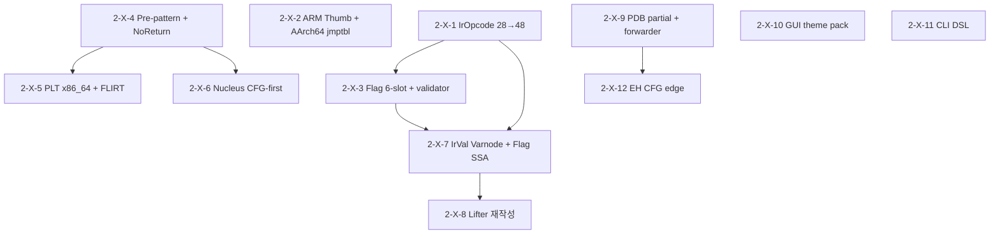

# AURA Ghidra-급 Parity Master Roadmap

> **작성**: Session #9 Final Curator (Task #45, 2026-04-21).
> **근거**: 17 문서 — Research 12 (Ghidra 3 + Rizin 3 + x64dbg 6) + Comparison 4 (#41/#42/#43/#44) + README v3 (#40).
> **성격**: 미래 세션이 본 문서 **단 하나만 읽고** Phase 2-X-* 에 착수할 수 있는 implementation-ready backlog.
> **Live canonical**: `AUTOMATION_ROADMAP.md`. 본 문서는 그 하위 입력으로 쓰이는 **백로그 원천**.
> **라이선스 경계**: Ghidra Apache-2.0 참조 자유, Rizin LGPL-3 scratch 재구현 필수, x64dbg GPL-3 clean-room 이식 원칙.

---

## 0. How to use this doc (재활용 가이드)

본 문서는 4-축 질문 지도로 설계되었다.

| 질문 | 찾아갈 곳 |
|------|-----------|
| "다음 세션에 뭐 하지?" | **§2 Critical Path** — 12 Phase 의 실행 순서 테이블 |
| "특정 개선의 spec?" | **§4 Phase 2-X-* 상세** — 각 Phase 의 파일/API/TDD/커밋/세션/Δ |
| "왜 이 순서인가?" | **§3 의존성 그래프** (ASCII + mermaid) |
| "원 연구 근거는?" | 각 Phase 의 *인용* 필드 — `#NN § X.Y` 형식으로 17 문서 역추적 |
| "지금 AURA 어디?" | **§1 현재 상태 snapshot** |
| "X 는 왜 Phase 2-X 에서 빠졌나?" | **§9 추가 backlog (Phase 2-X 밖)** |
| "회귀 위험?" | **§5 Risk / Contingency** |

**원칙**: 본 문서의 Phase 2-X-* 는 **PR 단위**로 매핑된다 (`feedback_aura_versioning_policy.md`). 각 Phase 완료 시 `AUTOMATION_ROADMAP.md` 의 해당 Step 을 `[x]` 로 갱신하고, `MEMORY.md` 에 요약 한 줄 추가.

---

## 1. 현재 상태 snapshot (2026-04-21)

### 1.1 Parity & 지표

- **Ghidra parity 추정**: ~55–60 점 (real-binary covered_avg 55 plateau; rc3 baseline).
- **Real-binary covered_avg**: cat 15.8% / ls 45.1% / aura-self 87.6% (overfitting, `feedback_aura_benchmark_bias.md`).
- **AArch64 stripped**: Recall 80.5% / Precision 93.6% / F1 0.866 (목표 0.92).
- **테스트**: `build-rel` 144/144 + `build-asan` 135/135 + `smoke` 90/90.
- **벤치**: C-7 x86 cross-compile corpus (`2624869`) 로 rc3 x86 측정 가능.

### 1.2 Session #9 git 상태 (HEAD: `2ebe264`)

Phase 2-A~2-E 커밋:

| 커밋 | 주제 |
|------|------|
| `60c181f` | 거버넌스 3-layer 드리프트 방지 |
| `7e9c4bd`/`5fc43b0` | cmake `-S . -B build` 통일 / AURA_BIN fallback |
| `e0f17b2`/`8a6982e`/`8ce85e9` | B-1~B-3 postdom annotation / 6-stage INFO / HIR_SEQ counter |
| `02e4a4f`/`9ba8a25` | B-4 rc2 baseline + commit-hash fix |
| `7de43ec` | Phase 2-B governance 완주 문서 |
| `ab5fe6b`~`2624869` | C-1~C-7 opt-in 래핑 + x86 fixture |
| `e4741a7`/`95f0bec` | Pre-1 ET_REL CALL reloc / Pre-2 homogeneous-stride array |
| `c2beabd`/`2ebe264` | E-1 CHK postdom / E-2 EH flow HIR_COMMENT |

### 1.3 정책 (Session #9 결정)

- **Ghidra 급 도달 전까지 tag/version 금지** — `feedback_aura_versioning_policy.md` (rc3 이후 적용).
- **PR-based workflow** — `master → main` 직접 푸시 금지, PR 병합만.
- **Live canonical**: `AUTOMATION_ROADMAP.md` > `Tasks.md` > 메모리.
- **Language**: C/C++ 전용, 인터프리터 금지 (`feedback_aura_interp_lang_scope.md`).
- **Plugin 시스템**: PRD §4.1 유보 유지, v3.0.0 이전 재검토 금지.

### 1.4 Phase 2 진행 흐름 (v2.3.0)

```
2-A ────▶ 2-B (research + baseline) ────▶ 2-C (opt-in wiring) ────▶
2-D (quality bugs, 대기) ────▶ 2-E (EH flow + postdom) ────▶
2-X-1 ... 2-X-12 (본 문서가 정의)
```

Phase 2-D (truncated body 3-요인: function-detection + CFG reconstruction + hir_builder term=NULL bail) 는 Phase 2-X 와 독립 — 별도 세션 (`project_quality_bugs_session8.md`).

---

## 2. Critical Path — 가장 짧은 실행 순서

**정렬 기준**: (i) parity Δ 최대화, (ii) 의존성 최소화, (iii) 단일 PR 완결성.

| 순서 | Phase | 주제 | 예상 세션 | 예상 Δ parity | 의존 | 출처 |
|------|-------|------|----------|--------------|------|------|
| 1 | **2-X-1** | IrOpcode 28→48 확장 (RzIL Phase A) | 1–2 | +4~6 | 없음 | #28 R-S1, #32 Phase A |
| 2 | **2-X-4** | Pre-pattern gate + prologue triple + NoReturn DB 확장 | 1 | **F1 +0.03~0.05** | 없음 | #26 S-1/S-2/S-4, #30 |
| 3 | **2-X-2** | ARM/Thumb mapping + AArch64 adrp+ldr+br jump table | 1–2 | **+5~20** (stripped) | 없음 | #27 S-1/S-3, #31 S-A/S-B |
| 4 | **2-X-3** | Flag 3→6 slot cache + JumpBasic-lite + validator | 1–2 | +6~10 | 2-X-1 | #28 R-S2, #27 S-2 |
| 5 | **2-X-9** | PDB partial load + forwarder + Ordinal# + dual-name | 1–2 | +1~3 (Windows) | 없음 | #33, #39, #43 REC-S1/S3/S4 |
| 6 | **2-X-5** | PLT x86_64 + PE IAT + FLIRT sigdb (#41 §3 R-P1/P2 + R-F1) | 2–3 | +2~5 | 2-X-4 | #26 S-5, #30 F-1/P-1 |
| 7 | **2-X-12** | EH→CFG edge (Phase 3.14 완결) + CFI VM partial | 2–3 | **+5~8** | 2-X-9 (dual-name) | #39 §2.4, #43 REC-M1 |
| 8 | **2-X-6** | Nucleus CFG-first (clean-room Andriesse) | 2–3 | **+3~7** (stripped) | 2-X-4 | #30 N-1 |
| 9 | **2-X-7** | IrVal Varnode refactor + Flag Global SSA (RzIL Phase B) | 2–3 | prereq for 2-X-8 | 2-X-1, 2-X-3 | #32 Phase B, #28 R-S2 |
| 10 | **2-X-10** | GUI Theme registry + Token color + Log hyperlink | 1–2 | N/A (UX) | 없음 | #37 P9/P7, #44 S-gui-2/3/10 |
| 11 | **2-X-11** | CLI ExpressionParser DSL (`--filter` stage 1) | 1–2 | N/A (자동화) | 없음 | #33 §5, #38 §3.2, #44 S-cli-1 |
| 12 | **2-X-8** | Lifter 재작성 (codegen 분할 + arm64 silent fallback 제거) | 3–5 | **+3~5** | 2-X-7 | #32 Phase C, #42 §5 |

### 2.1 Δ 누적 예상 parity trajectory

현재 55–60 → 2-X-1~4 (IR + disasm + func 개선) → ~65–70 → 2-X-9/12 (symbol + EH) → ~70–75 → 2-X-5/6 (PLT + Nucleus) → ~75–78 → 2-X-7/8 (Lifter 재작성) → **80+**.

### 2.2 세션 총합

- **단기** (2-X-1 ~ 2-X-5): 7–11 세션 (Phase 2-X-1 ~ 2-X-5)
- **중기** (2-X-6 ~ 2-X-9): 6–11 세션
- **장기 UX/arch** (2-X-10/11): 2–4 세션
- **장기 Lifter** (2-X-8): 3–5 세션

**합계**: **21–33 세션**. 예상 parity **~55 → 80+**.

### 2.3 단기 top-3 (다음 1–3 세션 즉시 실행 권장)

1. **2-X-1 IrOpcode 28→48** — prereq 이 0, 후속 2-X-3/7/8 의 모든 기반. 1 커밋, RED-first TDD, risk LOW.
2. **2-X-4 Pre-pattern gate + NoReturn DB** — Precision +0.03~0.05 (FP 주범 차단). 2-3 커밋, 양쪽 확증 (Ghidra+Rizin).
3. **2-X-2 ARM/Thumb + AArch64 adrp+ldr+br** — real-binary cat 15.8% 벙어리 근본 원인 (external call target 미해석). risk MED, 2 커밋.

---

## 3. 의존성 그래프

### 3.1 ASCII

```
                ┌──── 2-X-1  IrOpcode 28→48 (prereq)
                │       │
                │       ├──── 2-X-3  Flag 6-slot + JumpBasic-lite + validator
                │       │       │
                │       │       └──── 2-X-7  IrVal Varnode + Flag Global SSA (Phase B)
                │       │               │
                │       │               └──── 2-X-8  Lifter 재작성 (codegen 분할 + arm64 fix)
                │       │
                │       └──── 2-X-2  ARM Thumb + AArch64 jmptbl  (disasm-level)
                │                       │
                │                       └── 8-byte entry param → Phase 2-X-7 sort 확장
                │
                ├──── 2-X-4  Pre-pattern gate + Prologue triple + NoReturn DB
                │       │
                │       ├──── 2-X-5  PLT x86_64 / PE IAT / FLIRT
                │       │
                │       └──── 2-X-6  Nucleus CFG-first (stripped recall)
                │
                ├──── 2-X-9  PDB partial + forwarder + Ordinal# + dual-name
                │       │
                │       └──── 2-X-12 EH→CFG edge + CFI VM (symbol dual-name 필요)
                │
                ├──── 2-X-10 GUI Theme registry + Token color + Log hyperlink  (독립)
                │
                └──── 2-X-11 CLI ExpressionParser DSL subset                 (독립)
```

### 3.2 Mermaid



### 3.3 병렬 가능 쌍

- **2-X-1 ⊥ 2-X-2 ⊥ 2-X-4 ⊥ 2-X-9 ⊥ 2-X-10 ⊥ 2-X-11** — 서로 disjoint, 사용자 결정에 따라 multi-worktree 병렬 가능.
- **2-X-3/2-X-5/2-X-6** — 2-X-1/2-X-4 완주 후 동시 착수 가능.
- **2-X-7/2-X-8** — 하나의 IR big-bang bundle 이므로 **단일 세션 격리 필수** (§5 Risk).

---

## 4. Phase 2-X-* 상세 spec (implementation-ready)

각 Phase 는 다음 항목을 제공: **Goal / Files / API / TDD plan / Commit estimate / Session estimate / Δ parity / 인용 / Notes**.

---

### 4.1 Phase 2-X-1: IrOpcode 28 → 48 확장 (RzIL Phase A)

- **Goal**: AURA IR 의 `IrOpcode` enum 을 28 → 48 로 확장. Flag producer (CARRY/SCARRY/SBORROW/IS_ZERO) + 부호 확장 (ZEXT/SEXT/TRUNC) + 부호 분리 산술 (SDIV/UDIV/SREM/UREM/SAR) + 단항/비트 (NEG/NOT/ROL/ROR/POPCOUNT/CLZ/CTZ/APPEND/EXTRACT) 총 20 opcode.
- **근거**: `#28` R-S1 (Ghidra PCode CPUI_INT_SEXT/SDIV/UDIV 등), `#32` Phase A (RzIL `zext`/`sext`/`sdiv`/`udiv`), `#42` §3 Table 2-X-1 § `2-X-1. IrOpcode 28 → 48 확장`.
- **수정 파일**:
  - `include/decompiler.h` — `IrOpcode` enum 에 20 항목 추가.
  - `src/decompiler/codegen.c::opcode_name` (L2320-2350) — 20 case 추가 + 기존 `"???"` 버그 (CMP_UGT/UGE/GT/GE) 동시 수정.
  - `src/decompiler/codegen.c::LIFT_BINOP` (L524-552) — SAR 추가, 나머지는 `LIFT_UNOP` 새 매크로 정의.
  - `src/decompiler/arm64_lifter.c` — `adcs/sbcs/sdiv/udiv` 리프팅 확장.
  - `src/decompiler/hir_builder.c::hir_lift_instr` — 20 case 추가.
  - `src/decompiler/pseudo_c_printer.c` — `ZEXT`/`SEXT` 캐스트 출력, `POPCOUNT` 는 `__builtin_popcount()` 로 렌더.
  - `include/hir.h` — `HIR_UNOP_BOOL` / `HIR_UNOP_POPCOUNT` 필요 시 추가.
- **TDD plan**:
  - RED: `tests/decompiler/test_ir_opcodes.c` (신규) — 20 opcode 각각 MIR-style golden assert. 빌드 시 opcode undefined → fail.
  - 회귀: 기존 `tests/decompiler/test_real_binary.sh` + `cmov`/`csel` 의미 보존 check.
  - `CMP_UGT` 프린터 수정 단독 test (`tests/decompiler/test_opcode_name_printer.c`).
- **Commit estimate**: 3–4
  1. enum + opcode_name case 20 (빌드 pass)
  2. LIFT_BINOP SAR + LIFT_UNOP 매크로 + codegen 사용처
  3. hir_builder + pseudo_c_printer 캐스트/POPCOUNT
  4. (option) validator seed — `src/decompiler/ir_validator.c` 3-rule lite (§4.4 와 병합 가능)
- **Session estimate**: 1–2
- **Δ parity**: +4~6
- **인용**: `#28` R-S1, `#32` Phase A, `#42` §3.1–3.7, `#40` README v3 §1.3 #1.
- **Notes**: `IrType` 은 건드리지 않음 — `{BV, width}` 전환은 Phase 2-X-7 (`IrSort`).

---

### 4.2 Phase 2-X-2: ARM/Thumb mapping + AArch64 adrp+ldr+br

- **Goal**: (a) Capstone 핸들의 `CS_MODE_ARM` 하드코딩 제거 + ELF mapping symbol `$a`/`$t`/`$d` 소비. (b) AArch64 `adrp x0,@L; add x0,x0,:lo12:@L; ldr x1,[x0,x2,lsl#3]; br x1` 3-instr jump-table 패턴 인식. (c) ARM `tbb`/`tbh` 테이블.
- **근거**: `#27` S-1/S-3, `#31` S-A/S-B (양쪽 확증), `#42` §3.3/3.4.
- **수정 파일**:
  - `src/disasm/capstone_wrapper.c:60-68` — `DisasmContext` 에 `cs_mode_t cur_mode` 추가. `cs_option(h, CS_OPT_MODE, new_mode)` 동적 전환.
  - `src/parser/elf_parser.c` — ELF symbol 순회 시 `st_name == "$a"/"$t"/"$d"` 인 것을 주소→모드 매핑 테이블에 저장 (`ArmMappingTable`).
  - `src/core/recursive_disasm.c` — 각 PC 에서 mapping table lookup, mode 가 바뀌면 Capstone 재구성.
  - `src/disasm/indirect_resolver.c::resolve_jump_table` — dispatcher 로 분해:
    ```c
    static bool resolve_jmptbl_x86      (…);          /* 기존 */
    static bool resolve_jmptbl_aarch64  (…);          /* adrp+add+ldr+br */
    static bool resolve_jmptbl_arm_tbb  (…);          /* .tbb byte table */
    static bool resolve_jmptbl_arm_tbh  (…);          /* .tbh halfword table */
    ```
  - 8-byte entry 하드코딩은 `entry_size` 파라미터화.
- **API 변경**:
  ```c
  /* include/arm_mapping.h (신규) */
  typedef enum { ARM_MODE_A32, ARM_MODE_T32, ARM_MODE_DATA } ArmMappingMode;
  ArmMappingMode arm_mapping_lookup(const ArmMappingTable *t, uint64_t va);
  ```
- **TDD plan**:
  - RED: `tests/disasm/test_indirect_aarch64.sh` (신규, frozen AArch64 fixture) — `adrp+ldr+br` 패턴으로 만든 switch 가 N 개 case 를 수집하는지 assert. 현재 구현에선 0 개.
  - `tests/disasm/test_thumb_mapping.sh` (신규) — ARM ELF 에서 `$t` 구간의 명령이 Thumb 디코드, `$a` 구간이 ARM 디코드.
  - `tests/benchmark/regression_harness.sh --aura build-rel/aura` 통과.
- **Commit estimate**: 2–3
  1. Capstone 모드 전환 + mapping symbol 로더
  2. `indirect_resolver.c` 4-dispatcher 분해 + entry_size 파라미터화
  3. ARM TBB/TBH (AArch64 만 긴급하면 분리)
- **Session estimate**: 2
- **Δ parity**: **+5~20** (stripped binary — cat/ls 실측 15.8%/45.1% 구조적 천장은 external call 미해석 + jump table 누락 결합)
- **인용**: `#27` §3.2 SLEIGH context / §4 JumpModel, `#31` §2.1 RzAsm / §3.4 jmptbl.c 4-dispatch, `#42` §3.3 / §3.4, `#40` README v3 §1.3 #2.
- **Notes**: Rizin `jmptbl.c` 직접 copy 금지. 파일 최상단에 `// algorithm inspired by Rizin jmptbl.c, clean-room reimplementation` 주석 필수.

---

### 4.3 Phase 2-X-3: Flag cache 3→6 slot + JumpBasic-lite + validator

- **Goal**: codegen.c 의 `last_cmp_*` 3-scalar 를 CF/OF/ZF/SF/PF/AF 6-slot FlagCache (block-local) 로 교체. x86 `ADD/SUB/AND/OR/XOR/SHL/SHR/SAR` 가 각 slot 에 `CARRY/SCARRY/IS_ZERO/EXTRACT` producer 를 emit, `Jcc` 는 slot id 를 branch predicate 으로 사용. JumpBasic-lite: switch pattern 인식 시 `JumpModel`-class (Basic/Override) 2-분기. Lite validator 3-rule (type/SSA/reachability).
- **근거**: `#28` R-S2, `#27` S-2, `#32` local effect, `#42` §3.2 / §3.7.
- **수정 파일**:
  - `src/decompiler/codegen.c:430-432` — `last_cmp_*` 제거, `FlagCache` 구조체로 교체:
    ```c
    typedef struct {
        uint32_t cf_id;  /* CARRY producer */
        uint32_t of_id;  /* SCARRY producer */
        uint32_t zf_id;  /* IS_ZERO producer */
        uint32_t sf_id;  /* EXTRACT high-bit */
        uint32_t pf_id;  /* POPCOUNT %2, optional */
        uint32_t af_id;  /* adjust flag, optional */
    } FlagCache;
    ```
  - `x86_lift_add`/`sub`/`and`/`or`/`xor`/`shl`/`shr`/`sar` 각각에서 6 slot 중 관련 emit.
  - `x86_lift_jcc` — `last_cmp_id` 대신 flag slot 의 SSA id 로 branch.
  - `src/disasm/indirect_resolver.c` — `jmptbl` dispatcher 를 **model 2-분기**로 추상화 (Basic = 패턴 확정 / Override = 하드코딩 주소). 4-class 풀 구조는 Phase 2-X-8 C-5.
  - `src/decompiler/ir_validator.c` (신규) — 3-rule lite: (1) type compat, (2) single-def SSA (phi 제외), (3) reachability.
  - `tests/CMakeLists.txt` — validator 를 ctest 에 `AURA_IR_VALIDATE=1` 기본 on 으로 삽입.
- **API 변경**:
  ```c
  /* src/decompiler/codegen.c (internal) */
  static void flag_cache_reset(FlagCache *fc);
  static uint32_t flag_cache_read(const FlagCache *fc, FlagSlot slot);
  ```
- **TDD plan**:
  - RED: `tests/decompiler/test_flag_cache.c` — `add eax, ebx` 뒤 `jo` 가 `branch flag.of` 로 SSA-화되는지 assert. 현재는 `branch cmp_ne(%t1, 0)` fail.
  - `arm64_lifter.c:127` silent CMP_NE fallback 에서 `b.mi`/`b.vs` 가 fallback 적중하지 않는지 counter 로 확인 (Phase 2-X-8 에서 완전 제거, 여기선 block-local 만).
  - `tests/decompiler/test_ir_validator.c` — 일부러 type-incompat IR 주입 → validator fail.
  - `tests/benchmark/regression_harness.sh` 전체 통과.
- **Commit estimate**: 3–4
  1. FlagCache 구조체 + x86 lifters emit (single commit, 회귀 가드 필수)
  2. Jcc predicate 변경 + `last_cmp_*` 제거
  3. indirect_resolver JumpBasic/Override 2-class
  4. validator + ctest 삽입
- **Session estimate**: 1–2
- **Δ parity**: +6~10
- **인용**: `#28` R-S2 (per-block cmp stack), `#27` §4 JumpModel 4-class, `#32` §3.3 local effect, `#42` §3.2 / §3.3 / §3.7, `#40` README v3 §1.3 #3.
- **Notes**: 아직 block-local — 글로벌 phi 합류는 Phase 2-X-7 B-2.

---

### 4.4 Phase 2-X-4: Pre-pattern gate + Prologue triple + NoReturn DB (func_detect)

- **Goal**: func_detect 의 Precision 을 +0.03~0.05 끌어올리는 3-레버 동시 적용. (a) Pre-pattern gate: prologue 후보 앞 바이트가 `ret/nop/ud2/int3/brk/hlt` 또는 tail jump 인 경우만 수락. (b) Prologue triple: x86 `push rbp + mov rbp,rsp + sub rsp,N` 및 AArch64 `stp x29,x30 + mov x29,sp` 3-insn 연쇄를 `CAND_CONF_PROLOGUE_TRIPLE=120` 신설 tier 로 승격. (c) NoReturn DB: builtin 50 → 120 (glibc/musl/libstdc++/Rust/Go/Windows CRT + PE exception).
- **근거**: `#26` S-1/S-2/S-4, `#30` S-4 (양쪽 확증 — LOW risk), `#41` §4.1 H-S1 / §4.2 G-S1 / §4.3 G-S2.
- **수정 파일**:
  - `src/symbolic/func_detect.c` — 신규 static `pre_pattern_is_code_end(const DisasmResult *prev, AuraArch arch)` 약 L200 부근.
  - `src/symbolic/func_detect.c:254-305` Phase A — 각 prologue match 에서 `i > 0 ? &insns[i-1] : NULL` 로 gate 호출, false 시 confidence -30 또는 skip. `.eh_frame`/symbol 후보 (Phase D/E) 는 영향 없음 (이미 120+).
  - `src/symbolic/func_detect.c:254-305` Phase A — x86 3-insn TRIPLE 매치 추가.
  - `src/symbolic/func_detect_internal.h:50-52` — `CAND_CONF_PROLOGUE_TRIPLE = 120` 신설 (PUSH_MOV=80 과 CALL=180 사이).
  - `src/core/noreturn_detect.c:83-` — builtin names 배열 50 → 120 항목 확장. Rust `rust_panic`, `_ZN4core9panicking5panic*`, Go `runtime.goexit/throw/gopanic`, libstdc++ `__cxa_throw/_Unwind_Resume`, Windows `ExitProcess/TerminateProcess/__fastfail/_invalid_parameter_noinfo_noreturn` 등.
  - `src/core/noreturn_detect.c` — 신규 함수 `noreturn_detect_emit_boundaries()` post-pass: noreturn call 다음 aligned 주소를 `CAND_CONF_NORETURN_BOUNDARY=90` 으로 후보 방출.
  - `include/noreturn_detect.h` — 프로토타입 공개.
  - `src/core/pipeline.c` — `func_detect` 이후 `noreturn_detect_emit_boundaries()` 호출 훅.
- **API 변경**:
  ```c
  /* include/noreturn_detect.h */
  typedef struct {
      AuraAddr post_ret_addr;
      AuraAddr noreturn_func;
      uint8_t  confidence;
  } NoreturnBoundary;

  uint32_t noreturn_detect_emit_boundaries(
      const NoreturnResult *nr,
      const DisasmResult *insns, size_t count,
      CandidateSet *out);
  ```
- **TDD plan**:
  - RED: `tests/symbolic/test_func_detect_pre_pattern.c` (신규) — `ret` 뒤 prologue 수락 / random 뒤 prologue 거부.
  - `tests/symbolic/test_func_detect_prologue.c` (신규) — 3-insn fixture 가 confidence 120 등록.
  - `tests/core/test_noreturn_detect.c` (연장) — `call __stack_chk_fail; <aligned addr>` 패턴에서 aligned addr 가 후보로 방출 (count==1 & confidence==90).
  - `tests/benchmark/bench_func_detect.sh` 재측정 — F1 +0.03~0.05.
- **Commit estimate**: 3–4
  1. `pre_pattern_is_code_end` helper + Phase A gate 적용
  2. TRIPLE tier + x86/AArch64 3-insn 매치
  3. NoReturn DB 확장 (50→120)
  4. `noreturn_detect_emit_boundaries` + pipeline 훅
- **Session estimate**: 1
- **Δ parity**: **F1 +0.03~0.05**, P +0.005, R +0.01
- **인용**: `#26` §5.1 S-1/S-2/S-4, `#30` §7.3 공통 S-4, `#41` §4.1/§4.2/§4.3 spec, `#40` README v3 §1.3 #4.
- **Notes**: H-S1 noreturn 확장은 Phase 2-E CHK postdom (c2beabd) 와 **cross-check 필수** — commit 후 `2ebe264` HIR_COMMENT 도 재시험.

---

### 4.5 Phase 2-X-5: PLT x86_64 + PE IAT + FLIRT sigdb

- **Goal**: (a) x86_64 SysV ELF PLT stub (`ff 25 / 68 / e9` 16-byte) 감지. (b) PE IAT thunk (`ff 25` 6-byte RIP-rel) 감지. (c) IDA-compat FLIRT `.pat`/`.sig` loader + CRC16 module.
- **근거**: `#26` S-5, `#30` F-1/P-1, `#41` §4.4 R-P1 + §3 R-P2/R-F1, `#40` README v3 §1.3 #4/#5.
- **수정 파일**:
  - `src/symbolic/func_detect_plt.c` — 현재 88 LOC AArch64-only. 신규 `detect_plt_x86_64_elf()`, `detect_plt_pe_iat()`. Dispatcher 를 `fi->arch` 로 분기. 추후 분할 가능 (plt_aarch64.c / plt_x86_64.c / plt_pe.c).
  - `src/parser/elf_parser.c` — 기존 `.rela.plt` 파싱 활용. 필요 시 reloc index → PLT[n] 매핑 API 노출.
  - `src/core/flirt.c` (현재 492 LOC 자체 포맷, 완전 재작성) → `src/core/flirt_legacy.c` 로 rename.
  - `src/core/flirt_ida.c` (신규) — IDA FLAIR `.pat`/`.sig` 파서, CRC16 util.
  - `third_party/sigdb/` — build-time `FetchContent_Declare` (권장, `third_party/sqlite/` 전례).
  - `src/symbolic/func_id.c` — FLIRT 매칭 결과로 이름 적용 path.
- **API 변경**:
  ```c
  /* include/flirt.h */
  typedef struct FlirtSigDB FlirtSigDB;
  FlirtSigDB *flirt_load_ida_sig(const char *path);
  const char *flirt_match(FlirtSigDB *db, const uint8_t *body, size_t len, uint16_t *crc16_out);
  void        flirt_free(FlirtSigDB *db);
  ```
- **PLT x86_64 패턴**:
  ```
  FF 25 xx xx xx xx     ; jmp qword ptr [rip + GOT]   6B
  68 xx xx xx xx        ; push imm32                  5B
  E9 xx xx xx xx        ; jmp PLT[0]                  5B  => 16B stride
  ```
  PLT[0] 은 `ff 35 / ff 25 / 00 00 00 00`. `.plt.sec`/`.plt.got` 변종은 MVP 에서 `.plt` 만.
- **PE IAT 패턴**: `.idata` + `FirstThunk` 의 `ff 25 xx xx xx xx` 6-byte thunk.
- **Symbol 이름 매핑**: PLT[n] index → `.rela.plt[n].r_info` symbol index → `.dynsym[i].st_name`. `FuncEntry.name = "sym.imp.<name>"` (Rizin 규칙 참조, 재명명은 AURA 자유).
- **TDD plan**:
  - `tests/fixtures/x86_64_plt.elf` (신규) — 소형 C `puts("hi")` 프로그램 `gcc -no-pie -fno-stack-protector` + strip.
  - `tests/symbolic/test_func_detect_plt.c` 에 x86_64 case 추가 — PLT count == `.rela.plt` count, 각 name resolved.
  - `tests/fixtures/pe_iat.exe` (cross-compile x86_64-w64-mingw32-gcc) — IAT stub 감지.
  - `tests/core/test_flirt_ida.c` — 공개 IDA `.pat` 최소 10 함수 매칭.
- **Commit estimate**: 5–6
  1. x86_64 PLT detector + fixture + test
  2. PE IAT detector + fixture + test
  3. FLIRT IDA `.pat` 파서 + CRC16
  4. FLIRT `.sig` 파서 (binary format)
  5. sigdb FetchContent + CMake
  6. func_id 통합
- **Session estimate**: 2–3
- **Δ parity**: +2~5 (x86_64 binary recall +0.03~0.05, naming +30~50%p)
- **인용**: `#26` §5.1 S-5, `#30` §8.4 P-1 / F-1, `#41` §4.4, `#40` README v3 §1.3 #5.
- **Notes**: FLIRT sigdb 번들 정책 Open (`#41` §8.1 — 번들 vs FetchContent). AURA 전례 `third_party/sqlite/` 따라 FetchContent 우선.

---

### 4.6 Phase 2-X-6: Nucleus CFG-first (clean-room Andriesse)

- **Goal**: 함수 탐지를 compiler-agnostic CFG-first 로 전환 — 의심 후보 주소에서 linear sweep + BB boundary 역추적. stripped binary recall 을 +0.08~0.15 끌어올림.
- **근거**: `#30` N-1 (Andriesse-Slowinska IEEE EuroS&P 2017), `#41` §3.2 R-N1 / §5, `#40` README v3 §1.3 #6.
- **수정 파일**:
  - `src/symbolic/func_nucleus.c` (신규, ~500–700 LOC) — clean-room 재구현. LGPL 전파 방지: Rizin `librz/analysis/fcn.c` 직접 copy 금지, 논문만 참조. 파일 최상단 `// clean-room reimplementation of Andriesse-Slowinska 2017 CFG-first function detection`.
  - `src/symbolic/func_detect.c:425-427` — Phase G 뒤에 Nucleus Phase 추가 (opt-in `AURA_FUNC_NUCLEUS=1`).
  - `src/symbolic/func_detect_internal.h` — `CAND_SRC_NUCLEUS=…`, `CAND_CONF_NUCLEUS_CFG=150` 추가.
  - `src/symbolic/cfg.c` — BB builder API 일부 노출 (`cfg_from_block_seed`).
- **알고리즘** (clean-room 요약):
  1. 후보 주소 집합 S = {PLT stubs, CALL targets, symbol, FDE, .init_array, prologue-high} (기존 Phase A–G 결과).
  2. 각 a ∈ S 에서 linear sweep 디코드 → BB 경계 (unconditional branch / ret / noreturn call / invalid).
  3. Outgoing edge 추적 → reachable BB set.
  4. 두 후보가 같은 BB 에 도달 → "child" 를 제거 (overlap resolution).
  5. 생존 seed 만 `CandidateSet` 에 `CAND_SRC_NUCLEUS` 로 등록.
- **TDD plan**:
  - `tests/fixtures/stripped_nucleus.elf` (신규, `-fno-unwind-tables -fno-asynchronous-unwind-tables` 로 FDE 제거) — Nucleus 가 Phase 이전 recall 과 비교해 +10%p 이상.
  - `tests/benchmark/regression_harness.sh --aura build-rel/aura` — 종합 F1 측정.
  - ASan test — overlap 해소가 dangling pointer 안 내기.
- **Commit estimate**: 3–4
- **Session estimate**: 2–3
- **Δ parity**: **+3~7** (stripped), 일반 바이너리는 +1~2
- **인용**: `#30` §3.2 Nucleus, Andriesse et al. IEEE EuroS&P 2017, `#41` §3.2 R-N1.
- **Notes**: LGPL 전파 방지. `third_party/nucleus/` 는 **금지** — 전부 `src/symbolic/func_nucleus.c` 에서 scratch.

---

### 4.7 Phase 2-X-7: IrVal Varnode refactor + Flag Global SSA (RzIL Phase B)

- **Goal**: (a) `IrVal = {id, type, imm}` → `IrVal = {id, IrSort sort, imm}` big-bang 전환. `IrType enum 14` 를 `IrSort {IR_SORT_BV|BOOL|FLOAT|MEM|VOID, width}` 구조체로 대체. (b) Flag 6-slot 을 `IrFunc::FlagStream flags[6]` 전역 SSA 로 승격, phi 합류로 block 간 전파. (c) opbuilder DSL 매크로 도입. (d) validator 확장 (sort propagation, flag producer, phi agreement).
- **근거**: `#32` Phase B, `#28` R-S2/R-S3, `#42` §4 Phase B, `#40` README v3 §1.3 #7.
- **수정 파일** (대공사):
  - `include/decompiler.h` — `IrType` 제거, `IrSort` 구조체 + helper `ir_sort_i/bool/float/ptr`. `IrVal` 수정. `IrFunc` 에 `FlagStream flags[6]` 추가.
  - `src/decompiler/codegen.c` 전역 sed: `IR_TYPE_INT64` → `ir_sort_i(64)` 등. 매핑 표 `#42` §4.A.
  - `src/decompiler/arm64_lifter.c`, `hir_builder.c`, `pseudo_c_printer.c`, 16 pass (`sccp/const_fold/copy_prop/…`) 전부 수정.
  - `src/decompiler/ir_opbuilder_begin.h` / `ir_opbuilder_end.h` (신규) — `#42` §4.B 매크로 세트.
  - `src/decompiler/ir_validator.c` — 규칙 3→6 확장 (flag producer / sort propagation / phi agreement).
  - `src/decompiler/codegen.c` FlagCache → `IrFunc::flags[6]` SSA id.
- **API 변경** (breaking):
  ```c
  typedef enum { IR_SORT_BV, IR_SORT_BOOL, IR_SORT_FLOAT, IR_SORT_MEM, IR_SORT_VOID } IrSortKind;
  typedef struct { IrSortKind kind; uint16_t width; uint16_t align; } IrSort;
  typedef struct { uint32_t id; IrSort sort; int64_t imm; } IrVal;

  IrSort ir_sort_i(uint16_t w);
  IrSort ir_sort_bool(void);
  IrSort ir_sort_float(uint16_t w);
  IrSort ir_sort_ptr(uint16_t w);
  ```
- **Flag SSA**:
  ```c
  typedef struct { uint32_t head_id; uint32_t *phi_preds; } FlagStream;
  /* IrFunc.flags[0] = CF, [1]=OF, [2]=ZF, [3]=SF, [4]=PF, [5]=AF */
  ```
- **TDD plan**:
  - 가드레일 (#42 §4.A 체크리스트):
    1. 헬퍼 선 추가 → 빌드 통과
    2. Enum → 구조체 매핑 표 확정
    3. `sed` 전역 치환, 컴파일 에러 전수 수정
    4. `tests/decompiler/test_ir_sort.c` (신규) — sort 비교 헬퍼
    5. `mnemonic[16]` / `dst_pointee_width` 일부 제거 검토
    6. `tests/decompiler/test_real_binary.sh` + `regression_harness.sh` — 회귀 < 5%
  - `tests/decompiler/test_flag_ssa.c` — cross-block flag 전파 (add eax, ebx; jmp .L; .L: jc label) phi 합류.
  - `tests/decompiler/test_ir_validator_ext.c` — sort/flag/phi rule 6.
- **Commit estimate**: 4–6
  1. IrSort 헬퍼 선 추가 (빌드 pass)
  2. IrType → IrSort big-bang 전환 (단일 세션 격리, 반나절 block)
  3. Flag Global SSA (6-slot phi)
  4. opbuilder DSL 도입
  5. validator 확장 (rule 4/5/6)
  6. (opt) pass op-mask dispatch (Ghidra `getOpList()` 차용)
- **Session estimate**: 2–3
- **Δ parity**: prereq for 2-X-8 (단독 효과는 제한적, 단 기존 real-binary 회귀 < 5% 유지가 목표)
- **인용**: `#32` Phase B (RzIL Bitvector sort + opbuilder), `#28` R-S2/S3, `#42` §4 / §4.A / §4.B, `#40` README v3 §1.3 #7.
- **Notes**: **단일 big-bang 세션 격리 필수**. 2-X-8 과 세트로 진행 권장 (§5 Risk).

---

### 4.8 Phase 2-X-8: Lifter 재작성 (codegen 분할 + arm64 silent fallback 제거)

- **Goal**: `codegen.c` 2438 LOC 를 `src/decompiler/x86/{lift_arith.c, lift_logic.c, lift_mem.c, lift_branch.c, lift_fp.c}` 로 분할. `arm64_lifter.c:127` silent CMP_NE fallback **완전 제거** — `b.mi/pl/vs/vc`, `csel`, `csinc`, `csinv`, `csneg` 전부 flag SSA predicate 으로. `adrp+add`/`adrp+ldr` fusing 으로 전역 주소 재구성. FP lifter 14 opcode (`IR_OP_FADD/FSUB/FMUL/FDIV/FSQRT/FCMP_*` + `IR_SORT_FLOAT{32,64,80}`). JumpModel 4-class (Basic/Override/Assisted/TableModel).
- **근거**: `#32` Phase C, `#42` §5 / §5.A, `#40` README v3 §1.3 #8.
- **수정 파일**:
  - `src/decompiler/codegen.c` (2438 LOC) → 분할:
    - `src/decompiler/x86/lift_arith.c` — ADD/SUB/MUL/SDIV/UDIV/… + flag emit.
    - `src/decompiler/x86/lift_logic.c` — AND/OR/XOR/SHL/SHR/SAR/ROL/ROR.
    - `src/decompiler/x86/lift_mem.c` — MOV/LEA/LOAD/STORE/PUSH/POP.
    - `src/decompiler/x86/lift_branch.c` — Jcc/CALL/RET/JMP.
    - `src/decompiler/x86/lift_fp.c` — addss/addsd/movss/sqrtsd/…
  - `src/decompiler/arm64_lifter.c` — `arm64_cond_to_ir_opcode` silent fallback 제거, `arm64_lift_b_cond` 신설 (#42 §5.A 스케치):
    ```c
    static void arm64_lift_b_cond(cs_insn *insn, IrBlock *blk) {
        arm64_cc cc = insn->detail->arm64.cc;
        uint32_t pred_id;
        switch (cc) {
          case ARM64_CC_EQ: pred_id = cur_fn->flags[ZF].head_id; break;
          case ARM64_CC_NE: pred_id = emit_not(cur_fn->flags[ZF].head_id); break;
          case ARM64_CC_MI: pred_id = cur_fn->flags[SF].head_id; break;
          case ARM64_CC_PL: pred_id = emit_not(cur_fn->flags[SF].head_id); break;
          case ARM64_CC_VS: pred_id = cur_fn->flags[OF].head_id; break;
          case ARM64_CC_VC: pred_id = emit_not(cur_fn->flags[OF].head_id); break;
          case ARM64_CC_LT: pred_id = emit_xor(sf, of); break;
          case ARM64_CC_GE: pred_id = emit_not(emit_xor(sf, of)); break;
          case ARM64_CC_GT: pred_id = emit_and(emit_not(zf), emit_not(emit_xor(sf,of))); break;
          case ARM64_CC_LE: pred_id = emit_or(zf, emit_xor(sf,of)); break;
          case ARM64_CC_HI: pred_id = emit_and(cf, emit_not(zf)); break;
          case ARM64_CC_LS: pred_id = emit_or(emit_not(cf), zf); break;
          case ARM64_CC_HS: pred_id = cur_fn->flags[CF].head_id; break;
          case ARM64_CC_LO: pred_id = emit_not(cur_fn->flags[CF].head_id); break;
          case ARM64_CC_AL: case ARM64_CC_NV: default: pred_id = ir_const_bool(true); break;
        }
        ir_emit_branch(blk, pred_id, target_block_id, fallthrough_block_id);
    }
    ```
  - `src/decompiler/arm64_lifter.c` — `csel`/`csinc`/`csinv`/`csneg` → `IR_OP_SELECT` with flag predicate.
  - `src/decompiler/jumpmodel.c` (신규) — 4-class 전략: Basic (패턴 확정) / Override (하드코딩) / Assisted (사용자 힌트) / TableModel (Ghidra-style 구조체).
- **API 변경**:
  ```c
  /* include/aura_lifter.h */
  typedef enum { LIFT_X86_64, LIFT_ARM64, LIFT_X86_32, LIFT_ARM32 } LiftArch;
  int aura_lift_function(LiftArch arch, const DisasmResult *insns, size_t n, IrFunc *out);
  ```
- **TDD plan**:
  - `tests/decompiler/test_arm64_csel.c` — 16 condition code 전부 flag SSA predicate 으로 emit, silent CMP_NE 0건 assert.
  - `tests/decompiler/test_adrp_add_fusion.c` — `adrp x0, page; add x0, x0, :lo12:sym` 이 단일 PTRADD IR 로 fusing.
  - `tests/decompiler/test_fp_lifter.c` — `addsd`/`movss` → `FADD`/`FMOV` with `IR_SORT_FLOAT`.
  - `tests/decompiler/test_real_binary.sh` — rc1 대비 **goto 23% → 8-12%**, cap_hits 93% → 75%, arm64 csel parity 0% → **60%+**.
  - `tests/benchmark/regression_harness.sh` — 종합 parity +3~5.
- **Commit estimate**: 10–15
  1. x86 codegen 분할 (3 commit)
  2. arm64 b.cond + csel/csinc/csinv/csneg 재작성 (3 commit)
  3. adrp+add/ldr fusing (2 commit)
  4. FP lifter 14 opcode (2 commit)
  5. JumpModel 4-class (2 commit)
  6. (opt) ArchProfile 플러거블 / m68k/ppc/mips stub (1–4 commit)
- **Session estimate**: 3–5
- **Δ parity**: +3~5 (single biggest correctness unlock)
- **인용**: `#32` Phase C, `#42` §5 / §5.A (arm64 sketch), `#40` README v3 §1.3 #8.
- **Notes**: Phase 2-X-7 sort/flag-ssa 선행 필수. 2-X-7/2-X-8 는 세트로 "IR recapitalization" 번들.

---

### 4.9 Phase 2-X-9: PDB partial + forwarder + Ordinal# + dual-name (Symbol pack)

- **Goal**: Windows PE 리버싱 recall 을 x64dbg 수준으로 수렴. 4-레버 묶음:
  (a) **PDB partial loading** — 512MB cap 제거, GSI/PSI lazy stream decode (`#43` REC-S1).
  (b) **PE forwarder chain** — `kernel32!CreateFileA → kernelbase` resolve (`#43` REC-S3).
  (c) **Ordinal-only synthetic name** — `Ordinal#N` (`#43` REC-S4).
  (d) **Decorated + undecorated dual-name search** — `pdb_find_symbol` 가 두 필드 모두 match (`#43` REC-S2).
- **근거**: `#33` §4, `#39` §2.1-2.3 / §2.6, `#43` REC-S1/S2/S3/S4, `#40` README v3 §1.3 #9.
- **수정 파일**:
  - `src/parser/pdb_parser.c:616` cap 제거, `MsfStream { block_list, block_count, data (lazy NULL) }` 재구조화. `msf_stream_ensure()` 신설.
  - `src/parser/pdb_parser.c::pdb_find_symbol` — `decorated` + `undecorated` 양쪽 search.
  - `include/pdb_info.h` — `MsfStream` 확장. 기존 `PdbSymbol` 에 `decorated`/`undecorated` dual field.
  - `src/parser/pe_parser.c:248-301 fill_exports` 재작성:
    - `NumberOfFunctions` 반복 + name→ordinal 역매핑.
    - `frva ∈ [EXPORT_DIR.VA, EXPORT_DIR.VA+Size)` 체크 → forwarder 인식.
    - 미매칭 ordinal → `snprintf("Ordinal#%u", ordBase + i)`.
  - `include/file_format.h::Symbol` — `char *forwarder_target; bool synthetic;` 추가.
  - `src/parser/pe_parser.c` destroy path — `free(forwarder_target)`.
- **API 변경**:
  ```c
  /* include/pdb_info.h */
  int msf_stream_ensure(MsfFile *mf, uint32_t stream_idx);
  const PdbSymbol *pdb_find_symbol_dual(const PdbInfo *info, const char *name);
  ```
- **TDD plan**:
  - `tests/parser/test_pdb_partial.c` — 600MB+ PDB (synthetic) open, `pdb_find_symbol` 평균 미지 stream access, RSS < 30% 전체.
  - `tests/parser/test_pe_forwarder.c` — `kernel32.dll` `CreateFileA` forwarder_target == "KERNELBASE.CreateFileA".
  - `tests/parser/test_pe_ordinal.c` — Ordinal-only export 가 있는 test PE → `Ordinal#1` 등장.
  - `tests/parser/test_pdb_dual_name.c` — `_ZNSt3__1…` 와 `std::__1::basic_string` 양쪽 검색 성공.
- **Commit estimate**: 4–5
  1. PDB MsfStream lazy
  2. PE forwarder chain
  3. PE Ordinal# synthetic
  4. PDB dual-name search
  5. (opt) libc++ 대형 바이너리 검증 fixture
- **Session estimate**: 1–2
- **Δ parity**: +1~3 (Windows 전용, ELF 은 영향 없음)
- **인용**: `#33` §4 PDB, `#39` §2.1-2.3/§2.6, `#43` REC-S1/S2/S3/S4 § 6, `#40` README v3 §1.3 #9.
- **Notes**: libcurl 은 이미 의존. MSDIA140 재배포 이슈로 DIA SDK path 는 deferred (§9).

---

### 4.10 Phase 2-X-10: GUI Theme registry + Token color + Log hyperlink

- **Goal**: GUI UX 3-레버 — (a) Theme registry + JSON (현 Dark/Light enum → key-based registry), (b) Token → color lookup (pseudoc_highlighter 6 rule 을 theme key 로), (c) Log view hyperlink (console_panel `QPlainTextEdit` → `QTextBrowser` + `aura://goto-func/0x401000` URL scheme). Shortcut registry 확장 + dispatcher throttling 도 묶어 "Preferences" 창 탄생.
- **근거**: `#37` P9 (Configuration registry) / P7 (RichTextPainter) / §6.1 (Log hyperlink) / P13 (Shortcut), `#44` §2 ②③⑩⑧④ / §6 S-gui-2/3/10/8/4.
- **수정 파일**:
  - `src/gui/theme_registry.{cpp,h}` (신규, ~150 LOC) — `QColor color(key, fallback)` / `QFont font(key, fallback)` / `loadJson/saveJson` / `colorsUpdated` signal.
  - `src/gui/theme_manager.{cpp,h}` — enum → registry 위임, Dark/Light preset 유지.
  - `src/gui/pseudoc_highlighter.{cpp,h}` — `HighlightRule { QRegularExpression, QString colorKey }`, highlight 시 `ThemeRegistry::color(rule.colorKey)`.
  - `src/gui/console_panel.{cpp,h}` — `QPlainTextEdit` → `QTextBrowser`, `setOpenLinks(false)`, `anchorClicked(QUrl)` → `MainWindow::navigateToAddress`.
  - `src/gui/shortcut_manager.{cpp,h}` — Category/Global flag + 충돌 감지.
  - `src/gui/shortcuts_dialog.{cpp,h}` (신규).
  - `src/gui/analysis_dispatcher.{cpp,h}` — event-type 별 `QMap<AnalysisStage, QTimer>` + 100ms rate limit.
- **API 변경**:
  ```cpp
  class ThemeRegistry {
  public:
      static QColor color(const QString &key, const QColor &fallback = Qt::black);
      static QFont  font (const QString &key, const QFont  &fallback);
      static bool   loadJson(const QString &path);
      static void   saveJson(const QString &path);
      Q_SIGNAL void colorsUpdated();
  };
  ```
- **URL 스킴**: `aura://goto-func/0x401000`, `aura://goto-addr/0x12345`, `aura://open-cfg/0x401000`.
- **TDD plan**:
  - `tests/gui/test_theme_registry.cpp` — JSON roundtrip + fallback.
  - `tests/gui/test_pseudoc_highlighter.cpp` — 6 key lookup 치환 후 color 일치.
  - `tests/gui/test_console_hyperlink.cpp` — anchorClicked signal → navigateToAddress slot 경유.
  - Qt6 `QSignalSpy` 활용, offscreen 플랫폼 (`QT_QPA_PLATFORM=offscreen`).
- **Commit estimate**: 5–6
- **Session estimate**: 1–2
- **Δ parity**: N/A (UX)
- **인용**: `#37` P9/P7/§6.1/P13, `#44` §2 / §6 S-gui-2/3/10/8/4.
- **Notes**: `#44` §5.1 — x64dbg 3-DLL 분리 는 AURA PRD #4 정적 링크 위배, 채택 불가. x64dbg Bridge 자기규율 (ListInfo, C-ABI boundary) 는 Phase 2-X-12 참고.

---

### 4.11 Phase 2-X-11: CLI ExpressionParser DSL (shunting-yard subset)

- **Goal**: x64dbg ExpressionParser (shunting-yard, 14-레벨 C precedence) subset 이식. `--decompile-all --filter "size > 256" --sort "addr asc" --limit 100` 등 power-user CLI. AURA Stage 1: 산술 + 비교 + 논리 + 내장 함수 3 (`size(f)`, `addr(f)`, `name(f)`). Stage 2 (비트/문자열) 는 2-X-11+.
- **근거**: `#33` §5 CLI dispatcher, `#38` §3.2 ExpressionParser, `#44` §3 / §6 S-cli-1.
- **수정 파일**:
  - `src/cli/expr_parser.{c,h}` (신규, 500–800 LOC) — shunting-yard 파서 + AST + evaluator.
  - `src/cli/decompile_all.c` — `--filter` / `--sort` / `--limit` 옵션 수용 + AST → predicate 평가.
  - (future) `src/cli/cmd_*.c` — dispatcher registry 패턴 (v3.0.0 이후).
- **API 변경**:
  ```c
  /* include/aura/expr.h */
  typedef struct AuraExpr AuraExpr;
  AuraExpr *aura_expr_parse(const char *src, char **err);
  bool      aura_expr_eval_bool(const AuraExpr *e, const FuncEntry *f);
  int64_t   aura_expr_eval_int (const AuraExpr *e, const FuncEntry *f);
  void      aura_expr_free(AuraExpr *e);
  ```
- **Scope 제약** (rules.md §2):
  - 내장 함수만 (plugin 확장 금지).
  - 할당 / memory deref / register 읽기 **전부 제외** (runtime debugger 아님).
  - Stage 1: `+ - * / % < <= > >= == != && || !` + `size()/addr()/name()`.
  - Stage 2: `& | ^ ~ << >>` + 문자열 `"..."` + `starts`/`ends`/`contains`.
- **TDD plan**:
  - `tests/cli/test_expr_parser.c` — 100 test case (precedence/associativity/error path).
  - `tests/cli/test_decompile_all_filter.sh` (신규 또는 기존 연장) — `--filter "size > 256"` 이 예상 함수 subset 만 처리.
  - `tests/cli/test_expr_sort_limit.sh` — `--sort "addr asc" --limit 100`.
- **Commit estimate**: 3–4
- **Session estimate**: 1–2
- **Δ parity**: N/A (자동화 + 외부 tool 연동)
- **인용**: `#33` §5.1 `cmdnew`, `#38` §3.2 shunting-yard (1182 LOC 기준), `#44` §3.3 subset / §6 S-cli-1.
- **Notes**: 향후 GUI "Filter bar" (Phase 2-X-10 § master/detail) 와 동일 DSL 공유 — UX 일관성.

---

### 4.12 Phase 2-X-12: EH→CFG edge (Phase 3.14 완결) + CFI VM partial

- **Goal**: `.eh_frame` LSDA → CFG exception edge + CFI VM partial + PE `.pdata`/`.xdata` 통합. 현재 AURA 는 FDE candidate (G1) + HIR_COMMENT (E-2) 까지만 사용 — **CFG edge 는 미생성**. C++ 바이너리의 try/catch 재구성 가능성 확보.
- **근거**: `#39` §2.4 (`.pdata`/`.xdata` ↔ `.eh_frame`), `#43` REC-M1 / §7 critical path, `#40` README v3 §1.3 #12, Phase 3.14 문서 "completion" 목표.
- **수정 파일**:
  - `include/cfg.h` — `CFG_EDGE_EXCEPTION` edge type 추가 (fallthrough/branch/call 과 구분).
  - `src/symbolic/eh_cfg.c` (신규) — `EhRegion { region_start, region_length, landing_pad, action }` → edge:
    predecessor BB 의 `region_start..region_start+region_length` 에 걸친 마지막 `call/invoke` 뒤에 `EH_THROW` edge 를 `landing_pad` BB 로.
  - `src/core/pipeline.c` — `eh_cfg_attach_edges()` plumbing (AURA_EH_FLOW 확장).
  - `src/parser/eh_frame_parser.c` — CFI VM partial: DW_CFA_* bytecode stack machine 으로 callee-saved 복원 규칙 산출. stack var type 추론 hazard-free 확보.
  - `src/parser/pe_unwind.c` (신규) — PE `.pdata` `RUNTIME_FUNCTION` + `.xdata` `UNWIND_INFO/UNWIND_CODE` 5 opcode (UWOP_PUSH_NONVOL / ALLOC_LARGE / ALLOC_SMALL / SET_FPREG / SAVE_NONVOL / PUSH_MACHFRAME) 디코드 → `EhFrameInfo` 통합.
- **API 변경**:
  ```c
  /* include/cfg.h */
  typedef enum {
      CFG_EDGE_FALLTHROUGH, CFG_EDGE_BRANCH_TRUE, CFG_EDGE_BRANCH_FALSE,
      CFG_EDGE_CALL, CFG_EDGE_RETURN,
      CFG_EDGE_EXCEPTION   /* NEW */
  } CfgEdgeKind;

  /* include/eh_cfg.h */
  int eh_cfg_attach_edges(FileInfo *fi, Cfg *cfg);
  ```
- **TDD plan**:
  - `tests/parser/test_eh_cfg_edge.c` — libjvm.so (46,572 FDE) 파싱 후 EH edge 개수 == `region_count`.
  - `tests/decompiler/test_try_catch.sh` — C++ 바이너리 (aura-self 가능) 디컴파일 시 `landing_pad:` label 출력.
  - `tests/parser/test_pe_xdata.c` — 소형 MSVC PE 바이너리 `.xdata` 5 opcode 디코드.
  - `tests/benchmark/regression_harness.sh` — Ghidra parity baseline O0=72 → +5–8%p.
- **Commit estimate**: 4–6
  1. `CFG_EDGE_EXCEPTION` + edge 부착
  2. CFI VM partial (DW_CFA stack machine)
  3. PE `.pdata`/`.xdata` 디코드
  4. `EhFrameInfo` 통합 representation (OS-agnostic)
  5. HIR `try/catch` reconstruction (Phase 2-X-12 scope 에선 label 만, 구문 재조립은 후속)
  6. (opt) `.eh_frame_hdr` binary-search table 활용
- **Session estimate**: 2–3
- **Δ parity**: **+5~8** (single biggest single-step per `#39` note "이 한 단계만으로 +10-15 point 가 typical")
- **인용**: `#39` §2.4, `#43` REC-M1 / §7 critical path, `#40` README v3 §1.3 #12, Phase 3.14 문서.
- **Notes**: Phase 2-X-9 dual-name 선행 권장 (symbol 기반 exception site 매칭 정확도). AURA 는 `.eh_frame` + `.pdata` 통합 `EhFrameInfo` 로 OS-independent unwind 대표성을 확보 — 4-way (Ghidra/Rizin/x64dbg/AURA) 중 AURA 만 가능한 포지션.

---

## 5. Risk / Contingency

### 5.1 Phase 2-X-7 (IrSort 전환) big-bang

- **Risk**: 16 pass + 3 lifter + HIR + printer 전역 동시 수정 → 반나절+ 세션 격리 필수.
- **Contingency**:
  1. `ir_sort_i/bool/float/ptr` 헬퍼 **선 추가** + 기존 enum 공존 기간 (1 commit).
  2. 단일 세션 worktree 격리 (`.claude/worktrees/phase-2-x-7/`).
  3. 실패 시 `git reset --hard` 로 즉시 복귀 (별도 branch).
  4. `tests/decompiler/test_real_binary.sh` 회귀 > 5% 시 rollback.

### 5.2 Phase 2-X-8 (arm64 silent fallback 제거)

- **Risk**: `ARM64_CC_MI/PL/VS/VC/AL/NV` 6 조건은 현재 placeholder 로 작동 중 → 제거 시 기존 test 대량 재baselining 필요.
- **Contingency**:
  1. 2-X-7 Flag Global SSA 선행 없이 진행 불가 — 순서 엄수.
  2. Golden HIR text 비교 test 대량 갱신 (commit 5).
  3. `arm64_cond_to_ir_opcode` 단위 test 유지.

### 5.3 Phase 2-X-5 FLIRT sigdb 번들

- **Risk**: IDA FLAIR `.pat`/`.sig` 공개 sigdb 수백 MB — AURA repo 부담.
- **Contingency**: `FetchContent_Declare` (CMake, `third_party/sqlite/` 전례). user opt-in `AURA_ENABLE_FLIRT=ON`.

### 5.4 Phase 2-X-6 Nucleus LGPL 전파

- **Risk**: Rizin `librz/analysis/fcn.c` 직접 copy → LGPL-3 AURA 에 전파.
- **Contingency**: 논문 (Andriesse-Slowinska EuroS&P 2017) 만 참조. 파일 최상단 clean-room 선언. 코드 리뷰 체크리스트에 "Rizin fcn.c 열람 금지" 명시.

### 5.5 Phase 2-X-12 DW_CFA VM 무한 루프

- **Risk**: 악의/손상 `.eh_frame` 바이트코드로 VM 폭주.
- **Contingency**: 단계수 제한 `EH_CFA_MAX_STEPS=4096`, scratch register 상한 32, stack 깊이 64. fuzz test.

### 5.6 전체 회귀

- **Risk**: 각 Phase 의 +Δ 가 다른 Phase 의 회귀와 상쇄.
- **Contingency**: 각 Phase 완료 후 `tests/benchmark/regression_harness.sh --aura build-rel/aura` + `test_real_binary.sh` 필수. Ghidra parity baseline (O0=72/O1=69/O2=68) 를 never-regress 하는 gate.

---

## 6. 6-way Triangulation 최종 요약

`#40` README v3 §3 을 본 문서 축으로 재정리:

| 공통 주제 | 출처 | Phase 2-X-* | 확증도 |
|----------|------|-------------|--------|
| ARM/AArch64 디스어셈블러 정확도 | Ghidra #27 + Rizin #31 | **2-X-2** | 2/2 (양쪽 top) |
| PCode-style Low-IR 도입 | Ghidra #28 + Rizin #32 | **2-X-1 / 2-X-7 / 2-X-8** | 2/2 (blueprint) |
| Signature / Pattern DB | Ghidra #26 + Rizin #30 + x64dbg #33 | **2-X-4 / 2-X-5** | 3/3 |
| PDB Symbol engine (lazy + server) | x64dbg #33 + #39 | **2-X-9** | 2/2 (심층 2-doc) |
| Nucleus / FLIRT (stripped) | Rizin #30 (고유) | **2-X-5 / 2-X-6** | 1/3 (Rizin 고유) |
| Plugin architecture | x64dbg #38 + Rizin #30 + Ghidra #26 | **유보 (§9)** | 3/3 (but deferred) |
| GUI Qt 패널 MVC | x64dbg #37 (단독) | **2-X-10** | 1/1 (유일 Qt reference) |
| GUI↔Core bridge 자기규율 | x64dbg #36 | **§9 보류** (단일 프로세스이므로) | 개념 참고만 |
| EH flow + CFI | x64dbg #39 + AURA `.eh_frame` | **2-X-12** | 2/2 (OS-independent 차별화) |

---

## 7. AURA 컴포넌트 × Phase 매핑

| 컴포넌트 | 파일 | 해당 Phase 2-X-* | 예상 Δ 누적 |
|---------|------|------------------|-------------|
| **func_detect** | `src/symbolic/func_detect.c` | 2-X-4 / 2-X-5 / 2-X-6 | F1 +0.06~0.20 |
| **disasm** | `src/disasm/` + `recursive_disasm.c` | 2-X-2 | +5~20 |
| **IR + lifting** | `codegen.c`, `arm64_lifter.c`, `IrOpcode` | 2-X-1 / 2-X-3 / 2-X-7 / 2-X-8 | +15~25 |
| **Symbol + PDB** | `src/parser/pdb_parser.c`, `elf_parser.c`, `pe_parser.c` | 2-X-9 | +1~3 (Windows) |
| **EH / unwind** | `src/parser/eh_frame_parser.c` | 2-X-12 | +5~8 |
| **GUI** | `src/gui/` | 2-X-10 | UX (N/A) |
| **CLI** | `src/cli/`, `src/core/aura.c` | 2-X-11 | 자동화 (N/A) |
| **Plugin system** | (none) | **유보** (§9) | — |
| **Bridge** | (none) | **보류** (§9) | — |
| **Core engine (runtime)** | (none) | **scope 외** (§9) | — |

---

## 8. Policy 요약

- **`feedback_aura_versioning_policy.md`**: Ghidra parity 도달 전까지 tag/release 금지. Session #9 rc3 이후 PR-based workflow 만.
- **`feedback_aura_interp_lang_scope.md`**: C/C++ 전용. CLI DSL 은 내장 함수만 (plugin 확장 금지).
- **`feedback_aura_option_scope_discipline.md`**: team-lead/user 가 Option 지정 시 구현 중단하고 결정 대기. "검증 통과" 는 scope 초과 정당화 아님.
- **`feedback_aura_orchestration_mode.md`**: 병렬 작업은 TeamCreate + 명명 teammate 전용.
- **`feedback_ci_hardcoded_build_rel.md`**: 테스트 바이너리 경로 = CMake `$<TARGET_FILE:aura>`. `build-rel/` 하드코딩 금지, `/bin/cat` 하드코딩 금지.
- **라이선스**: AURA Apache-2.0. Ghidra Apache-2.0 자유 참조. Rizin LGPL-3 / x64dbg GPL-3 → **scratch 재구현 필수**. IDA Pro / Binary Ninja EULA 금지.
- **`__cxa_demangle`**: GCC Runtime Exception 정적 링크 허용 (PRD §4.2, 2026-03-26 승인).

---

## 9. 추가 backlog (Phase 2-X-* 밖)

본 Phase 2-X 에 포함되지 않지만 연구에서 발견된 항목 — 미래 세션 참고용.

### 9.1 Deferred (v3.0.0 재검토)

- **Plugin system** — PRD §4.1 유보. v3.0.0 이후 x64dbg 35 CBTYPE 중 6 (`AURA_CB_LOAD_FILE` / `FUNCS_DETECTED` / `CFG_BUILT` / `HIR_EMITTED` / `DECOMPILE_DONE` / `SAVE_PROJECT`) subset 검토 (`#44` §4.3).
- **DIA SDK Windows path** — msdia140 재배포 이슈 (`#43` REC-L1). v1.2 Windows-only + user-provided 감지로 secondary source 검토.
- **MAP file (Borland/VC/Watcom)** — 낮은 ROI (`#43` REC-L2). 사용자 요청 시 1 세션.
- **llvm-Demangle (MSVC undecorate on Linux)** — Med ROI / High 복잡도 (`#43` REC-L3).
- **m68k/ppc/mips lifter** (`#42` §5.4 C-4) — Capstone 디코드 가능, lifter 만 추가.
- **ArchProfile 플러거블** (`#42` §5.6 C-6) — 아키 추가 비용 감소.
- **HexDump multi-encoding ColumnDescriptor** (`#44` §2 ⑤) — type_editor 강화 후 재평가.
- **LabeledSplitter + MHTabWidget** (`#44` §2 ⑦) — QDockWidget 크래시 발생 시 재평가.
- **Trace recording / TRAC hit counter** — `#39` §3, **scope 외** (런타임 debugger 아님).
- **x64dbg core engine (runtime)** — `#35`, **scope 외**.

### 9.2 Stretch (Phase 2-X-13+)

- **GUI jump arrow side-bar** (`#44` §2 ⑥, S-gui-6) — 1 세션, UX 큰 차이.
- **GUI AbstractTableView (신규 view 한정)** (`#44` §2 ①, S-gui-1) — 1.5–2 세션.
- **aura_cfg_t C-ABI 경계** (`#44` §5.3, M-abi-1) — CLI/GUI 공유 ABI, 1–1.5 세션.
- **Medium-hash FID (24-unit body)** (`#41` §3.2 G-M3) — naming +10%p.
- **Per-processor InstructionSkipper** (`#41` §3.2 G-M4) — FID stability +20%.
- **PseudoDisassembler trial-decode validation** (`#41` §3.2 G-M5) — P +0.02~0.03.
- **DWARF `DW_TAG_subprogram` 경계 소비** (`#41` §3.2 G-M6) — unstripped R +0.05.
- **4-round 반복 scheduler** (`#41` §3.3 G-M7) — R +0.01~0.02.
- **zignatures graph feature** (`#41` §3.2 R-Z1) — uncertain, bench 필요.
- **Calling convention guess** (`#41` §3.2 R-E1) — param_id +10%p.
- **Go pclntab / Rust `__rust_*` / Swift metadata** (`#41` §3.3 G-L5) — 언어 특화 +20%p.

### 9.3 추가 연구 후보

사용자 판단 시 dispatch 가능:

- **RetDec** (MIT, LLVM) — middle-IR reference.
- **angr** (BSD-2) — CFG 복원 / taint / indirect target.
- **BAP** (MIT) — IL / lifter design.
- **Hex-Rays 공식 블로그 / 논문** (공개 정보만) — lifting / type recovery 상용 트렌드.

---

## 10. Session #9 실제 완료 기록

| 구분 | Agent | Task | 산출물 | LOC |
|------|-------|------|--------|-----|
| Research 1 | ghidra-analyst | #26 | `ghidra_func_detect_analysis.md` | ~330 |
| Research 2 | disasm-analyst | #27 | `ghidra_disasm_analysis.md` | ~402 |
| Research 3 | bridge-analyst | #28 | `ghidra_disasm_decompile_bridge_analysis.md` | ~546 |
| Research 4 | rizin-func-analyst | #30 | `rizin_func_detect_analysis.md` | ~1400 |
| Research 5 | rizin-disasm-analyst | #31 | `rizin_disasm_analysis.md` | ~350 |
| Research 6 | rizin-il-analyst | #32 | `rizin_il_analysis.md` | ~515 |
| Research 7 | x64dbg-analyst | #33 | `x64dbg_analysis.md` | ~432 |
| Research 8 | x64dbg-core | #35 | `x64dbg_core_engine.md` | ~300-450 |
| Research 9 | x64dbg-bridge | #36 | `x64dbg_bridge_api.md` | 262 |
| Research 10 | x64dbg-gui | #37 | `x64dbg_gui_panels.md` | ~500-700 |
| Research 11 | x64dbg-plugin | #38 | `x64dbg_plugin_scripting.md` | ~400-500 |
| Research 12 | x64dbg-symbol | #39 | `x64dbg_symbol_trace.md` | ~400-500 |
| Compare 1 | compare-func-detect | #41 | `aura_vs_func_detect.md` | 465 |
| Compare 2 | compare-disasm-ir | #42 | `aura_vs_disasm_ir.md` | 686 |
| Compare 3 | compare-symbol | #43 | `aura_vs_symbol.md` | 398 |
| Compare 4 | compare-gui-ext | #44 | `aura_vs_gui_extension.md` | 525 |
| Curator v1 | research-curator | #29 | `README.md` v1 | — |
| Curator v2 | curator-v2 | #34 | `README.md` v2 | — |
| Curator v3 | curator-v3 | #40 | `README.md` v3 | ~248 |
| **Final synthesis** | **final-curator** | **#45** | **`MASTER_ROADMAP.md` (본 문서)** | **~1000** |

**세션 총 산출물**: 17 문서 + 본 MASTER_ROADMAP = **18 문서**, 누적 LOC ~8500.

---

## 11. 인용 맵 (17 문서 × section)

### 11.1 Research 12

| # | 파일 | 본 roadmap 인용 위치 |
|---|------|---------------------|
| #26 | `ghidra_func_detect_analysis.md` | §4.4 (S-1/S-2/S-4/S-5), §4.5 (S-5), §9.2 |
| #27 | `ghidra_disasm_analysis.md` | §4.2 (S-1/S-3), §4.3 (S-2 JumpModel), §4.8 |
| #28 | `ghidra_disasm_decompile_bridge_analysis.md` | §4.1 (R-S1 PCode), §4.3 (R-S2), §4.7 (R-S2/S3), §4.8 |
| #30 | `rizin_func_detect_analysis.md` | §4.4 (S-4 noreturn), §4.5 (F-1/P-1), §4.6 (N-1 Nucleus) |
| #31 | `rizin_disasm_analysis.md` | §4.2 (S-A mapping / S-B adrp+ldr+br) |
| #32 | `rizin_il_analysis.md` | §4.1 (Phase A), §4.7 (Phase B), §4.8 (Phase C) |
| #33 | `x64dbg_analysis.md` | §4.9 (§4 PDB), §4.11 (§5 CLI), §9.1 (plugin) |
| #35 | `x64dbg_core_engine.md` | §9.1 (scope 외) |
| #36 | `x64dbg_bridge_api.md` | §9.1 (bridge 자기규율), §4.10 참고 |
| #37 | `x64dbg_gui_panels.md` | §4.10 (P7/P9/§6.1/P13) |
| #38 | `x64dbg_plugin_scripting.md` | §4.11 (§3.2 ExpressionParser), §9.1 (plugin) |
| #39 | `x64dbg_symbol_trace.md` | §4.9 (§2.1-2.3/§2.6), §4.12 (§2.4) |

### 11.2 Comparison 4

| # | 파일 | 본 roadmap 인용 위치 |
|---|------|---------------------|
| #41 | `aura_vs_func_detect.md` | §4.4 (H-S1/G-S1/G-S2), §4.5 (R-P1/P2/F1), §4.6 (R-N1), §9.2 (G-M3~7) |
| #42 | `aura_vs_disasm_ir.md` | §4.1 (§3 top 2-X-1), §4.3 (§3.2/3.3), §4.7 (§4 Phase B), §4.8 (§5 Phase C) |
| #43 | `aura_vs_symbol.md` | §4.9 (REC-S1/S2/S3/S4), §4.12 (REC-M1), §9.1 (REC-L1/L2/L3) |
| #44 | `aura_vs_gui_extension.md` | §4.10 (§2 / §6), §4.11 (§3 / §6 S-cli-1), §9.1 (plugin), §9.2 (stretch) |

### 11.3 Index

| # | 파일 | 본 roadmap 인용 위치 |
|---|------|---------------------|
| #40 | `README.md` v3 | §6 (6-way triangulation), §4.x (각 Phase 의 §1.3 순위) |

---

## 12. Next actions (권장)

다음 세션 (#10) 단기 top-3:

1. **Phase 2-X-1** (IrOpcode 28→48) 착수 — 의존 0, 후속 모든 IR Phase 의 기반. TDD RED → 3-4 commit → 1-2 세션.
2. **Phase 2-X-4** (Pre-pattern + NoReturn DB) 병렬 가능 — Precision +0.03~0.05 즉시. 1 세션.
3. **Phase 2-X-2** (ARM/Thumb + AArch64 adrp+ldr+br) 병렬 가능 — real-binary cat/ls 천장 원인. 2 세션.

위 3개는 모두 **disjoint** — TeamCreate + 3 teammate 병렬 가능 (`feedback_aura_orchestration_mode.md`).

**착수 전 체크리스트**:
- [ ] `AUTOMATION_ROADMAP.md` 에 Phase 2-X-1~12 Step 추가 (Live canonical).
- [ ] `Tasks.md` v2.3.0 snapshot 갱신 (release 경계).
- [ ] `MEMORY.md` 에 본 문서 링크 (Phase 2-X backlog entry point).
- [ ] `tests/benchmark/regression_harness.sh` + `tests/decompiler/test_real_binary.sh` baseline 기록.

---

**문서 종료**. Task #45 최종 synthesis 완료. 본 문서가 v2.3.0 이후 모든 Phase 2-X-* PR 의 입력 근거다.
